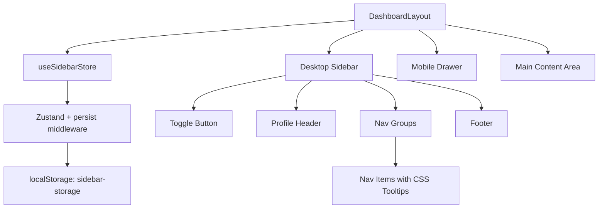

# Design Document: Collapsible Sidebar

## Overview

This feature adds collapse/expand functionality to the existing desktop sidebar in `DashboardLayout`. The sidebar toggles between 260px (expanded, icons + labels) and 68px (collapsed, icons only) with a smooth CSS transition. State persists via localStorage. CSS-only tooltips appear on hover in collapsed mode. The mobile drawer remains untouched.

The implementation is scoped to a single file (`dashboard/components/layout/dashboard-layout.tsx`) plus a small Zustand store for persistence, following the same pattern as `auth-store.ts`.

## Architecture



The architecture is intentionally flat. A single Zustand store (`useSidebarStore`) holds the `collapsed` boolean and a `toggle` action. The `DashboardLayout` component reads this state and conditionally applies Tailwind classes for width, text visibility, and transitions.

### Key Design Decisions

1. **Zustand store over local useState**: Persistence via `zustand/persist` middleware matches the existing `auth-store` pattern. This also allows other components to read sidebar state if needed in the future.

2. **CSS-only tooltips over a library**: A `group/navitem` + `group-hover/navitem` Tailwind pattern with an absolutely-positioned `<span>` avoids adding a dependency. The tooltip is a simple positioned element that appears on hover only when collapsed.

3. **CSS transitions over JS animation**: `transition-all duration-200` on the sidebar and main content area. Text elements use `opacity` + `transition-opacity` to fade in/out. No JavaScript animation libraries needed.

4. **Conditional rendering via opacity + overflow-hidden**: Text labels are not removed from the DOM during collapse — they fade to `opacity-0` and the container clips them with `overflow-hidden`. This avoids layout jumps and keeps transitions smooth.

## Components and Interfaces

### useSidebarStore (new file: `dashboard/lib/store/sidebar-store.ts`)

```typescript
interface SidebarState {
  collapsed: boolean;
  toggle: () => void;
}
```

- Uses `zustand/persist` with `createJSONStorage(() => localStorage)` under key `"sidebar-storage"`
- Default: `collapsed: false` (expanded)
- `toggle()`: flips `collapsed`

### DashboardLayout Changes

The existing `DashboardLayout` component gains:

1. **`collapsed` state** — read from `useSidebarStore`
2. **Toggle button** — a `<button>` rendered inside the desktop sidebar, positioned at the top-right or bottom of the sidebar. Uses `ChevronsLeft` / `ChevronsRight` icons from `lucide-react` (already installed). Has `aria-label` that changes based on state.
3. **Conditional sidebar width** — `w-[260px]` vs `w-[68px]` with `transition-all duration-200`
4. **Conditional text visibility** — text labels, group headers, profile name/restaurant, footer text all get `opacity-0`/`opacity-100` + `transition-opacity duration-200` based on `collapsed`
5. **Conditional main content offset** — `lg:pl-[260px]` vs `lg:pl-[68px]` with `transition-all duration-200`
6. **CSS tooltips on nav items** — when collapsed, each nav item wraps in a `group/navitem` container with an absolutely-positioned tooltip `<span>` that shows on `group-hover/navitem`
7. **Nav item centering** — when collapsed, nav items use `justify-center` instead of the default left-aligned layout

### Sidebar Content Rendering Helper

Extract a `sidebarContent` function/variable that accepts `collapsed: boolean` and renders the sidebar internals. This is used by both the desktop sidebar and the mobile drawer (mobile always passes `collapsed: false`).

### CSS Tooltip Pattern

```tsx
{/* Nav item with tooltip */}
<div className="relative group/navitem">
  <Link ...>
    <Icon />
    <span className={cn(
      "transition-opacity duration-200",
      collapsed ? "opacity-0 w-0 overflow-hidden" : "opacity-100"
    )}>
      {item.title}
    </span>
  </Link>
  {collapsed && (
    <span className="absolute left-full top-1/2 -translate-y-1/2 ml-2 px-2 py-1 bg-gray-900 text-white text-xs rounded shadow-lg whitespace-nowrap opacity-0 group-hover/navitem:opacity-100 pointer-events-none transition-opacity z-50">
      {item.title}
    </span>
  )}
</div>
```

## Data Models

### SidebarState (Zustand Store)

| Field | Type | Default | Description |
|-------|------|---------|-------------|
| `collapsed` | `boolean` | `false` | Whether the sidebar is in collapsed state |
| `toggle` | `() => void` | — | Toggles the collapsed state |

### localStorage Schema

Key: `"sidebar-storage"`

```json
{
  "state": {
    "collapsed": false
  },
  "version": 0
}
```

This follows the standard `zustand/persist` serialization format, identical to how `auth-storage` works.

### CSS Dimension Constants

| Constant | Value | Usage |
|----------|-------|-------|
| Expanded width | `260px` | Sidebar width in expanded state |
| Collapsed width | `68px` | Sidebar width in collapsed state |
| Transition duration | `200ms` | CSS transition timing for width and opacity |
| Tooltip offset | `ml-2` (8px) | Gap between sidebar edge and tooltip |


## Correctness Properties

*A property is a characteristic or behavior that should hold true across all valid executions of a system — essentially, a formal statement about what the system should do. Properties serve as the bridge between human-readable specifications and machine-verifiable correctness guarantees.*

### Property 1: Toggle round-trip

*For any* initial sidebar state (collapsed or expanded), toggling twice should return the sidebar to its original state.

**Validates: Requirements 1.2, 1.3**

### Property 2: Toggle button presence and accessible label

*For any* sidebar state, the toggle button should be present in the DOM and its `aria-label` should be "Collapse sidebar" when expanded or "Expand sidebar" when collapsed.

**Validates: Requirements 1.1, 1.4**

### Property 3: Text element visibility matches expanded state

*For any* nav item, group header, profile text, or footer text element, the element should be visible (opacity-100) when the sidebar is expanded and hidden (opacity-0 / overflow-hidden) when the sidebar is collapsed.

**Validates: Requirements 2.2, 3.2, 3.6**

### Property 4: Tooltip visibility is inverse of expanded state

*For any* nav item, a tooltip element containing the item's title should be rendered when the sidebar is collapsed, and no tooltip element should be rendered when the sidebar is expanded.

**Validates: Requirements 8.1, 8.2**

### Property 5: Persistence round-trip

*For any* sidebar collapsed state (true or false), persisting it to localStorage via the store and then creating a new store instance should restore the same collapsed value.

**Validates: Requirements 7.1, 7.2**

### Property 6: Mobile drawer renders expanded content regardless of collapse state

*For any* sidebar collapsed state, the mobile drawer should always render nav items with visible text labels (i.e., the mobile drawer always behaves as if expanded).

**Validates: Requirements 6.3**

## Error Handling

This feature has a minimal error surface since it's a client-side UI toggle with localStorage persistence.

| Scenario | Handling |
|----------|----------|
| localStorage unavailable (private browsing, quota exceeded) | Zustand's `persist` middleware handles this gracefully — the store works in-memory and the sidebar defaults to expanded. No crash. |
| Invalid/corrupted localStorage data | Zustand's `persist` middleware uses JSON parsing with a try-catch internally. On failure, it falls back to the default state (`collapsed: false`). |
| SSR hydration mismatch | The sidebar store initializes with `collapsed: false` on the server. On the client, `persist` rehydrates from localStorage. To avoid a flash, the sidebar should use the same default (expanded) on first render, then rehydrate. This matches the existing `auth-store` pattern. |
| Rapid toggle clicks | CSS transitions handle this naturally — the browser interpolates from the current position. No debouncing needed. |

## Testing Strategy

### Unit Tests

Unit tests cover specific examples and edge cases:

- Sidebar renders at 260px width class when expanded
- Sidebar renders at 68px width class when collapsed
- Profile header shows avatar + name + restaurant when expanded
- Profile header shows only avatar when collapsed
- Footer shows logout icon + text + version when expanded
- Footer shows only logout icon when collapsed
- Nav items are centered when collapsed
- Main content offset is 260px when expanded, 68px when collapsed
- Transition classes (`transition-all`, `duration-200`) are present on sidebar and main content
- Toggle button is hidden on mobile (has `hidden lg:flex` or similar)
- Mobile drawer always renders full nav item text regardless of collapse state
- Default state is expanded when no localStorage exists (edge case for Req 7.3)

### Property-Based Tests

Property-based tests use `fast-check` (the standard PBT library for TypeScript/React projects) with a minimum of 100 iterations per property.

Each property test references its design document property:

1. **Feature: collapsible-sidebar, Property 1: Toggle round-trip** — Generate a random initial boolean state, toggle twice via the store, assert state equals initial.
2. **Feature: collapsible-sidebar, Property 2: Toggle button presence and accessible label** — Generate a random boolean for collapsed, render the sidebar, assert toggle button exists with correct aria-label.
3. **Feature: collapsible-sidebar, Property 3: Text element visibility matches expanded state** — Generate a random collapsed state and pick a random nav item from the nav groups, render the sidebar, assert text element opacity/visibility matches the state.
4. **Feature: collapsible-sidebar, Property 4: Tooltip visibility is inverse of expanded state** — Generate a random collapsed state and pick a random nav item, render the sidebar, assert tooltip presence matches collapsed state.
5. **Feature: collapsible-sidebar, Property 5: Persistence round-trip** — Generate a random boolean, set it in the store, serialize to localStorage, create a fresh store, assert it reads back the same value.
6. **Feature: collapsible-sidebar, Property 6: Mobile drawer renders expanded content regardless of collapse state** — Generate a random collapsed state, render the mobile drawer content, assert all nav item text labels are visible.

### Test Configuration

- Library: `fast-check` with `@testing-library/react` for component rendering
- Minimum iterations: 100 per property test
- Each property test tagged with: `Feature: collapsible-sidebar, Property {N}: {title}`
