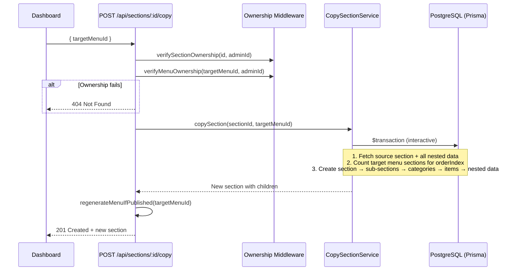
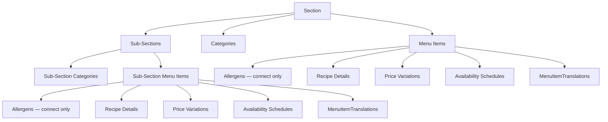

# Design Document: Copy Sections Between Menus

## Overview

This feature adds two capabilities to the menu management system:

1. **Section Description Field** — An optional multi-language `description` field on the `Section` model, stored as JSON (same format as `title`), with auto-translation support and rendering in menu templates.

2. **Copy Section to Another Menu** — A deep-clone operation that copies a section and all its nested entities (sub-sections, categories, menu items, allergens links, recipe details, price variations, availability schedules, translations) to a target menu. Works within the same restaurant or across restaurants owned by the same admin. All copied entities get new IDs and are fully independent from the originals.

The backend exposes a `POST /api/sections/:id/copy` endpoint. The dashboard adds a "Copy to..." action on sections that opens a modal with a menu picker grouped by restaurant.

## Architecture

The feature follows the existing Express.js + Prisma + PostgreSQL architecture. The copy operation is implemented as a new service (`copy-section.ts`) called from a new route handler on the sections router. The entire deep-clone runs inside a single Prisma interactive transaction to guarantee atomicity.



## Components and Interfaces

### Backend

#### 1. Prisma Schema Change
- Add optional `description Json?` field to the `Section` model.
- Migration: `ALTER TABLE sections ADD COLUMN description JSONB;`

#### 2. Validation Schema Update (`server/src/utils/validation.ts`)
- Add `description: z.record(z.string()).optional().nullable()` to `SectionSchema`.

#### 3. Copy Section Service (`server/src/services/copy-section.ts`)

```typescript
interface CopySectionResult {
  section: Section & {
    subSections: Section[];
    categories: Category[];
    items: (MenuItem & { allergens: AllergenIcon[] })[];
  };
}

async function copySection(
  sectionId: string,
  targetMenuId: string
): Promise<CopySectionResult>;
```

The service:
- Fetches the source section with all nested data (sub-sections recursively, categories, items with allergens/recipeDetails/priceVariations/availabilitySchedule/translations).
- Runs inside `prisma.$transaction()`.
- Recursively creates the section tree, mapping old category IDs to new ones so items maintain their category associations.
- Connects allergen links via `connect` (shared global records).
- Copies `imageUrl` as-is (shared asset).

#### 4. Section Route Extension (`server/src/routes/sections.ts`)

New endpoint: `POST /:id/copy`

```typescript
// Request body
{ targetMenuId: string }

// Response 201
{ /* newly created section with subSections, categories, items */ }

// Error responses
// 400 — missing/invalid targetMenuId
// 404 — section or target menu not found (or not owned)
// 500 — transaction failure
```

Validation:
- `targetMenuId` must be a valid UUID.
- `targetMenuId` must not be the same menu that already contains the source section (self-copy blocked; use existing duplicate endpoint instead).

#### 5. Auto-Translation Service Update (`server/src/services/auto-translate.ts`)
- Extend `autoTranslateMenu` to also translate `section.description` fields (same pattern as `section.title`).

#### 6. Menu Template Updates
- Update `MenuData` interface in templates to include optional `description` on sections/sub-sections.
- Update `coraflow-template.ts`, `card-based-template.ts`, and any other templates to render `description` below the section title when present.

#### 7. Ownership Middleware
- No new middleware functions needed. The route handler calls existing `verifySectionOwnership` and `verifyMenuOwnership` separately, both checking against the authenticated admin's ID.

### Frontend (Dashboard)

#### 1. Section Form Update
- Add a `MultiLanguageInput` for `description` in the section create/edit form (same pattern as `title`).

#### 2. "Copy to..." Action
- Add a "Copy to..." button in the section actions area of `SortableSection`.
- On click, open a `CopySectionModal` component.

#### 3. CopySectionModal Component (`dashboard/components/copy-section-modal.tsx`)

```typescript
interface CopySectionModalProps {
  sectionId: string;
  currentMenuId: string;
  isOpen: boolean;
  onClose: () => void;
  onSuccess: () => void;
}
```

The modal:
- Fetches all restaurants for the admin (existing `GET /api/restaurants` endpoint).
- For each restaurant, fetches its menus (existing `GET /api/menus/restaurant/:restaurantId`).
- Displays menus grouped by restaurant name.
- Disables the menu that already contains the source section.
- Shows a loading spinner during the copy operation.
- Disables the confirm button while loading.
- Shows success/error toast notifications.


## Data Models

### Section Model (Updated)

```prisma
model Section {
  id                       String   @id @default(uuid())
  menuId                   String   @map("menu_id")
  parentSectionId          String?  @map("parent_section_id")
  title                    Json     // Multi-language: { "ENG": "...", "CHN": "..." }
  description              Json?    // Multi-language (NEW): { "ENG": "...", "CHN": "..." }
  orderIndex               Int      @default(0) @map("order_index")
  illustrationUrl          String?  @map("illustration_url")
  illustrationAsBackground Boolean  @default(false) @map("illustration_as_background")
  illustrationPosition     String?  @map("illustration_position")
  illustrationSize         String?  @map("illustration_size")
  createdAt                DateTime @default(now()) @map("created_at")
  updatedAt                DateTime @updatedAt @map("updated_at")

  menu          Menu       @relation(fields: [menuId], references: [id], onDelete: Cascade)
  parentSection Section?   @relation("SectionSubsections", fields: [parentSectionId], references: [id], onDelete: Cascade)
  subSections   Section[]  @relation("SectionSubsections")
  categories    Category[]
  items         MenuItem[]

  @@map("sections")
}
```

### Deep Clone Data Graph

The copy operation clones the following entity tree. All entities get new UUIDs. Allergen links use `connect` (shared global records).



### Copy Request/Response

**Request:** `POST /api/sections/:id/copy`
```json
{
  "targetMenuId": "uuid-of-target-menu"
}
```

**Response (201):**
```json
{
  "id": "new-section-uuid",
  "menuId": "target-menu-uuid",
  "title": { "ENG": "Appetizers", "CHN": "开胃菜" },
  "description": { "ENG": "Served with bread", "CHN": "配面包" },
  "orderIndex": 3,
  "subSections": [...],
  "categories": [...],
  "items": [...]
}
```

**Error Responses:**
| Status | Condition |
|--------|-----------|
| 400 | Missing or invalid `targetMenuId`, or self-copy attempt |
| 404 | Source section or target menu not found / not owned |
| 500 | Transaction failure |


## Correctness Properties

*A property is a characteristic or behavior that should hold true across all valid executions of a system — essentially, a formal statement about what the system should do. Properties serve as the bridge between human-readable specifications and machine-verifiable correctness guarantees.*

### Property 1: Description field round-trip

*For any* valid multi-language JSON object used as a section description, creating a section with that description and then reading it back should return an equivalent JSON object.

**Validates: Requirements 1.1**

### Property 2: Auto-translation populates description for all active languages

*For any* section with a description provided in the default language, after running auto-translation, the description JSON should contain entries for all active languages.

**Validates: Requirements 1.4**

### Property 3: Template renders description when present

*For any* section with a non-null description, the generated HTML output should contain the description text. Conversely, for any section with a null or empty description, the generated HTML should not contain a description area for that section.

**Validates: Requirements 1.5, 1.6**

### Property 4: Copy preserves section-level properties

*For any* source section, copying it to a target menu should produce a new section whose `title`, `description`, `illustrationUrl`, `illustrationAsBackground`, `illustrationPosition`, and `illustrationSize` values are identical to the source.

**Validates: Requirements 2.1**

### Property 5: Copy assigns correct orderIndex

*For any* target menu with N existing top-level sections, copying a section into it should produce a new section with `orderIndex` equal to N.

**Validates: Requirements 2.2**

### Property 6: Copy generates new unique IDs for all entities

*For any* copied section tree, every entity ID (section, sub-sections, categories, items, recipe details, price variations, availability schedules, translations) in the copy should be different from every entity ID in the source tree.

**Validates: Requirements 2.3, 8.1**

### Property 7: Copy preserves structural relationships

*For any* source section with sub-sections and categorized items, the copied section should have the same sub-section tree structure (same depth and count at each level), and each copied item that was categorized in the source should be associated with the corresponding newly created category (not the original category).

**Validates: Requirements 2.4, 2.7**

### Property 8: Copy preserves nested data fidelity

*For any* source section, the copied section should contain the same number of categories (with identical names and orderIndex), the same number of menu items (with identical name, description, price, calories, imageUrl, orderIndex, isAvailable, preparationTime), the same allergen associations (linking to the same AllergenIcon IDs), and equivalent recipe details, price variations, availability schedules, and translations for each item.

**Validates: Requirements 2.5, 2.6, 2.8, 2.9, 8.2, 8.3**

### Property 9: Ownership enforcement rejects unauthorized requests

*For any* copy request where the authenticated admin does not own either the source section or the target menu, the API should return a 404 Not Found response regardless of whether the resources exist.

**Validates: Requirements 3.1, 3.2, 4.1, 4.2, 4.3**

### Property 10: Atomicity — failed copy leaves no partial data

*For any* copy operation that fails mid-transaction, the target menu should contain no new sections, categories, items, or any other entities that were part of the attempted copy.

**Validates: Requirements 5.1, 5.2**

### Property 11: Invalid targetMenuId returns 400

*For any* request to the copy endpoint where `targetMenuId` is missing, empty, not a valid UUID, or is the same menu that contains the source section, the API should return a 400 Bad Request response.

**Validates: Requirements 6.4**

## Error Handling

| Scenario | HTTP Status | Response Body | Notes |
|----------|-------------|---------------|-------|
| Missing or invalid `targetMenuId` | 400 | `{ "error": "targetMenuId is required and must be a valid UUID" }` | Zod validation |
| Self-copy (target = source menu) | 400 | `{ "error": "Cannot copy to the same menu. Use duplicate instead." }` | Explicit check |
| Source section not owned by admin | 404 | `{ "error": "Section not found" }` | Avoids leaking existence |
| Target menu not owned by admin | 404 | `{ "error": "Menu not found" }` | Avoids leaking existence |
| Source section doesn't exist | 404 | `{ "error": "Section not found" }` | Same as unauthorized |
| Target menu doesn't exist | 404 | `{ "error": "Menu not found" }` | Same as unauthorized |
| Transaction failure | 500 | `{ "error": "Internal server error" }` | Full rollback, logged server-side |
| Database connection error | 500 | `{ "error": "Internal server error" }` | Prisma handles retry |

The copy service catches all errors within the transaction block. If any Prisma operation fails, the interactive transaction automatically rolls back. The route handler catches service errors and returns appropriate HTTP responses.

## Testing Strategy

### Property-Based Testing

Use `fast-check` as the property-based testing library (already compatible with the Vitest test runner used in the project).

Each property test should run a minimum of 100 iterations. Each test must be tagged with a comment referencing the design property:

```typescript
// Feature: copy-sections-between-menus, Property 6: Copy generates new unique IDs for all entities
```

Property tests focus on:
- **Property 4**: Generate random section data (title, description, illustration fields), copy to a target menu, verify all fields match.
- **Property 5**: Generate a target menu with a random number of existing sections, copy a section, verify orderIndex equals the prior count.
- **Property 6**: Copy a section with random nested structure, collect all IDs from source and copy, verify zero intersection.
- **Property 7**: Generate sections with random sub-section trees and categorized items, copy, verify tree structure and category mappings are preserved.
- **Property 8**: Generate sections with random items having various nested data (allergens, recipe details, price variations, etc.), copy, verify data equivalence.
- **Property 9**: Generate random admin/section/menu ownership combinations, attempt copy, verify 404 for unauthorized requests.
- **Property 11**: Generate random invalid targetMenuId values (empty, non-UUID, self-menu), verify 400 response.

### Unit Testing

Unit tests complement property tests for specific examples and edge cases:
- Copy a section with no sub-sections, no categories, no items (minimal case).
- Copy a section with deeply nested sub-sections (3+ levels).
- Copy a section where items have no allergens, no recipe details (sparse data).
- Verify 400 when `targetMenuId` is missing from request body.
- Verify 404 when source section ID doesn't exist.
- Verify HTML regeneration is triggered when target menu is published.
- Verify HTML regeneration is NOT triggered when target menu is draft.
- Verify the description field is included in section CRUD operations.
- Verify auto-translation translates the description field.
- Verify template renders description below title.
- Verify template omits description area when description is null.

### Integration Testing

- End-to-end copy within same restaurant.
- End-to-end copy across restaurants owned by same admin.
- Verify copied entities are fully independent (edit copy, verify original unchanged).
- Verify transaction rollback on simulated failure.
