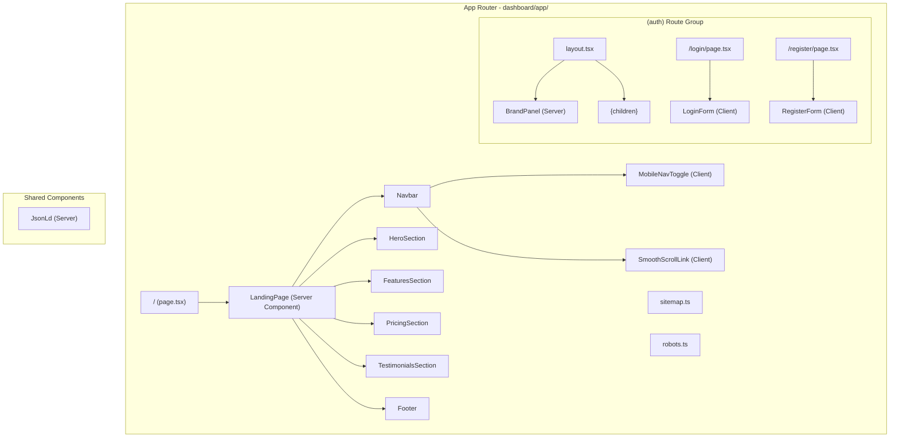

# Design Document: Landing Page

## Overview

This design covers the public-facing landing page for MenuBuildr at the root route (`/`), plus a redesigned split-screen authentication layout shared by `/login` and `/register`. The landing page is server-rendered for SEO, uses Next.js Server Components by default, and only opts into client components for interactive elements (mobile nav toggle, smooth scroll). The auth pages share a `BrandPanel` component for visual consistency and code reuse.

The implementation lives entirely within the existing `dashboard/` Next.js App Router application. No server (Express) changes are required — pricing data is hardcoded as static content for the landing page, and auth API calls remain unchanged.

### Key Design Decisions

1. **Server Components by default**: The landing page (`/`) is a Server Component. Only the `MobileNavToggle` and `SmoothScrollLink` components use `"use client"`. This minimizes JS shipped to the browser and maximizes LCP/INP performance.

2. **Shared `AuthLayout` + `BrandPanel`**: A single `(auth)/layout.tsx` route group wraps `/login` and `/register` with the split-screen layout. The `BrandPanel` is a Server Component rendered on the left. The auth forms on the right are Client Components (they manage form state).

3. **SEO via Next.js Metadata API**: All meta tags (OG, Twitter Cards, canonical, robots) are exported from `metadata` objects in page/layout files — no manual `<head>` manipulation. JSON-LD is rendered as `<script>` tags within Server Components.

4. **Next.js Image component**: All images use `next/image` for automatic WebP conversion, responsive srcsets, and lazy loading. The hero image uses `priority` for eager loading.

5. **Static sitemap/robots**: `sitemap.ts` and `robots.ts` files in the app root use Next.js file conventions for automatic generation.

6. **Client-side auth redirect**: The root page checks auth state client-side (via a thin wrapper component) and redirects authenticated users to `/dashboard`. The landing page content renders server-side for crawlers regardless.

## Architecture



### Route Structure

| Route | Component | Rendering | Purpose |
|-------|-----------|-----------|---------|
| `/` | `LandingPage` | Server (SSR) | Public landing page |
| `/login` | `(auth)/login/page.tsx` | Hybrid (layout=Server, form=Client) | Split-screen login |
| `/register` | `(auth)/register/page.tsx` | Hybrid (layout=Server, form=Client) | Split-screen registration |
| `/sitemap.xml` | `sitemap.ts` | Static generation | SEO sitemap |
| `/robots.txt` | `robots.ts` | Static generation | Crawler directives |

### Auth Redirect Strategy

The current root page (`/`) is a Client Component that immediately redirects. The new design changes this:

1. The root `page.tsx` becomes a Server Component that renders the full landing page HTML (crawlable).
2. A small `<AuthRedirect />` Client Component is included at the top. On mount, it checks `useAuthStore().isAuthenticated()` and calls `router.replace('/dashboard')` if true.
3. Search engine crawlers (no JS execution) see the full landing page. Authenticated users get redirected client-side.

This is the simplest approach given the current client-side-only auth (JWT in localStorage, Zustand store). No middleware or cookie-based auth changes are needed.

## Components and Interfaces

### Landing Page Components

```
dashboard/app/
├── page.tsx                          # Landing page (Server Component)
├── sitemap.ts                        # Dynamic sitemap generation
├── robots.ts                         # robots.txt generation
├── (auth)/
│   ├── layout.tsx                    # Split-screen auth layout
│   ├── login/
│   │   └── page.tsx                  # Login page with metadata
│   └── register/
│       └── page.tsx                  # Registration page with metadata
└── ...

dashboard/components/
├── landing/
│   ├── navbar.tsx                    # Navigation bar (Server Component)
│   ├── mobile-nav-toggle.tsx         # Hamburger menu (Client Component)
│   ├── smooth-scroll-link.tsx        # Anchor scroll links (Client Component)
│   ├── hero-section.tsx              # Hero section (Server Component)
│   ├── features-section.tsx          # Features grid (Server Component)
│   ├── pricing-section.tsx           # Pricing cards (Server Component)
│   ├── testimonials-section.tsx      # Testimonials (Server Component)
│   ├── footer.tsx                    # Footer (Server Component)
│   ├── json-ld.tsx                   # JSON-LD structured data (Server Component)
│   └── auth-redirect.tsx             # Auth check + redirect (Client Component)
├── auth/
│   ├── brand-panel.tsx               # Shared brand panel (Server Component)
│   ├── login-form.tsx                # Login form (Client Component)
│   └── register-form.tsx             # Registration form (Client Component)
└── ...
```

### Component Interfaces

```typescript
// landing/navbar.tsx - Server Component
export function Navbar(): JSX.Element
// Renders: <header><nav aria-label="Main navigation">
//   Logo, SmoothScrollLinks (Features, Pricing, Testimonials),
//   Login link, Get Started CTA button, MobileNavToggle
// </nav></header>

// landing/mobile-nav-toggle.tsx - Client Component ("use client")
export function MobileNavToggle({ 
  links: { label: string; href: string }[] 
}): JSX.Element
// Renders: hamburger button + collapsible menu on mobile (<768px)
// State: open/closed toggle

// landing/smooth-scroll-link.tsx - Client Component ("use client")
export function SmoothScrollLink({ 
  href: string;       // e.g. "#features"
  children: ReactNode;
  className?: string;
}): JSX.Element
// Handles: smooth scroll to section ID, updates URL hash

// landing/hero-section.tsx - Server Component
export function HeroSection(): JSX.Element
// Renders: <section id="hero" aria-labelledby="hero-heading">
//   h1 headline, p subheadline, Get Started CTA (Link to /register),
//   See Pricing CTA (SmoothScrollLink to #pricing),
//   Hero image (next/image with priority)

// landing/features-section.tsx - Server Component
export function FeaturesSection(): JSX.Element
// Renders: <section id="features" aria-labelledby="features-heading">
//   h2 heading, grid of <article> feature cards
//   Each card: icon (lucide-react), h3 title, p description

// landing/pricing-section.tsx - Server Component
export function PricingSection(): JSX.Element
// Renders: <section id="pricing" aria-labelledby="pricing-heading">
//   h2 heading, grid of <article> pricing cards
//   Each card: plan name, price, feature list, CTA Link to /register
//   Highlighted recommended plan, fallback message if no plans

// landing/testimonials-section.tsx - Server Component
export function TestimonialsSection(): JSX.Element
// Renders: <section id="testimonials" aria-labelledby="testimonials-heading">
//   h2 heading, grid of <article> testimonial cards
//   Each card: blockquote, customer name, restaurant name

// landing/footer.tsx - Server Component
export function Footer(): JSX.Element
// Renders: <footer aria-label="Site footer">
//   Logo + description, section links, auth links,
//   Terms/Privacy placeholders, copyright with current year

// landing/json-ld.tsx - Server Component
export function JsonLd({ data: Record<string, unknown> }): JSX.Element
// Renders: <script type="application/ld+json">{JSON.stringify(data)}</script>

// landing/auth-redirect.tsx - Client Component ("use client")
export function AuthRedirect(): JSX.Element | null
// On mount: checks useAuthStore().isAuthenticated()
// If true: router.replace('/dashboard')
// Renders: null (invisible component)

// auth/brand-panel.tsx - Server Component
export function BrandPanel(): JSX.Element
// Renders: gradient background div with:
//   MenuBuildr logo, product tagline, 2-3 feature highlights
//   Hidden on mobile (hidden md:flex), 50% width on desktop

// auth/login-form.tsx - Client Component ("use client")
export function LoginForm(): JSX.Element
// Renders: form with email, password, Sign In button,
//   Google OAuth button, "Don't have an account?" link to /register,
//   Link back to home (/)

// auth/register-form.tsx - Client Component ("use client")
export function RegisterForm(): JSX.Element
// Renders: form with name, email, password, confirm password,
//   Create Account button, Google OAuth button,
//   "Already have an account?" link to /login,
//   Link back to home (/)
```

### Auth Layout Component

```typescript
// app/(auth)/layout.tsx - Server Component
export default function AuthLayout({ children }: { children: ReactNode }) {
  return (
    <div className="min-h-screen flex">
      {/* Hidden on mobile, 50% on desktop */}
      <BrandPanel />
      {/* Full width on mobile, 50% on desktop */}
      <div className="w-full md:w-1/2 flex items-center justify-center p-8">
        {children}
      </div>
    </div>
  );
}
```

### Metadata Exports

```typescript
// app/page.tsx metadata (landing page)
export const metadata: Metadata = {
  title: 'MenuBuildr — Digital Menu Builder for Restaurants',
  description: 'Create and manage digital menus for your restaurants. Multi-language support, allergen management, and beautiful templates.',
  metadataBase: new URL('https://app.menubuildr.com'),
  alternates: { canonical: '/' },
  openGraph: {
    title: 'MenuBuildr — Digital Menu Builder for Restaurants',
    description: '...',
    url: 'https://app.menubuildr.com',
    siteName: 'MenuBuildr',
    type: 'website',
    images: [{ url: '/og-image.png', width: 1200, height: 630 }],
  },
  twitter: {
    card: 'summary_large_image',
    title: 'MenuBuildr — Digital Menu Builder for Restaurants',
    description: '...',
    images: ['/og-image.png'],
  },
  robots: { index: true, follow: true },
};

// app/(auth)/login/page.tsx metadata
export const metadata: Metadata = {
  title: 'Log In — MenuBuildr',
  robots: { index: false, follow: true },
};

// app/(auth)/register/page.tsx metadata
export const metadata: Metadata = {
  title: 'Create Account — MenuBuildr',
  robots: { index: false, follow: true },
};
```

## Data Models

### Static Data Structures

No database changes are required. All landing page content is static. The following TypeScript types define the data shapes used by components:

```typescript
// Feature card data
interface Feature {
  icon: string;          // Lucide icon name
  title: string;         // e.g. "Multi-Restaurant Management"
  description: string;   // Feature description paragraph
}

// Pricing plan data
interface PricingPlan {
  name: string;          // e.g. "Starter", "Pro"
  price: string;         // e.g. "$29", "Free"
  period: string;        // e.g. "/month"
  features: string[];    // List of included features
  recommended: boolean;  // Highlight flag
  ctaLabel: string;      // Button text
  ctaHref: string;       // Link destination
}

// Testimonial data
interface Testimonial {
  quote: string;         // Customer quote
  customerName: string;  // e.g. "[Customer Name]"
  restaurantName: string; // e.g. "[Restaurant Name]"
}

// JSON-LD structured data types
interface OrganizationJsonLd {
  '@context': 'https://schema.org';
  '@type': 'Organization';
  name: string;
  url: string;
  logo: string;
  sameAs: string[];
}

interface WebSiteJsonLd {
  '@context': 'https://schema.org';
  '@type': 'WebSite';
  name: string;
  url: string;
  potentialAction: {
    '@type': 'SearchAction';
    target: string;
    'query-input': string;
  };
}

interface ProductJsonLd {
  '@context': 'https://schema.org';
  '@type': 'Product';
  name: string;
  description: string;
  offers: {
    '@type': 'AggregateOffer';
    priceCurrency: string;
    lowPrice: string;
    highPrice: string;
    offerCount: number;
  };
}

// Sitemap entry
interface SitemapEntry {
  url: string;
  lastModified: Date;
  changeFrequency: 'daily' | 'weekly' | 'monthly';
  priority: number;
}
```

### Static Content Arrays

Feature, pricing, and testimonial data are defined as constant arrays within their respective section components (or in a shared `lib/constants/landing.ts` file). This keeps the data co-located and easy to update without database changes.

```typescript
// lib/constants/landing.ts
export const FEATURES: Feature[] = [
  {
    icon: 'Store',
    title: 'Multi-Restaurant Management',
    description: 'Manage menus across all your restaurant locations from a single dashboard.',
  },
  {
    icon: 'LayoutTemplate',
    title: 'Beautiful Menu Templates',
    description: 'Choose from Classic, Card Based, and Coraflow templates to match your brand.',
  },
  {
    icon: 'Languages',
    title: 'Multi-Language Support',
    description: 'Create menus in multiple languages to serve your diverse customer base.',
  },
  {
    icon: 'ShieldAlert',
    title: 'Allergen Management',
    description: 'Tag and display allergen information on every menu item for customer safety.',
  },
];

export const PRICING_PLANS: PricingPlan[] = [
  // Populated from existing Stripe plan data
];

export const TESTIMONIALS: Testimonial[] = [
  // Placeholder testimonials (to be replaced with real data)
];
```
