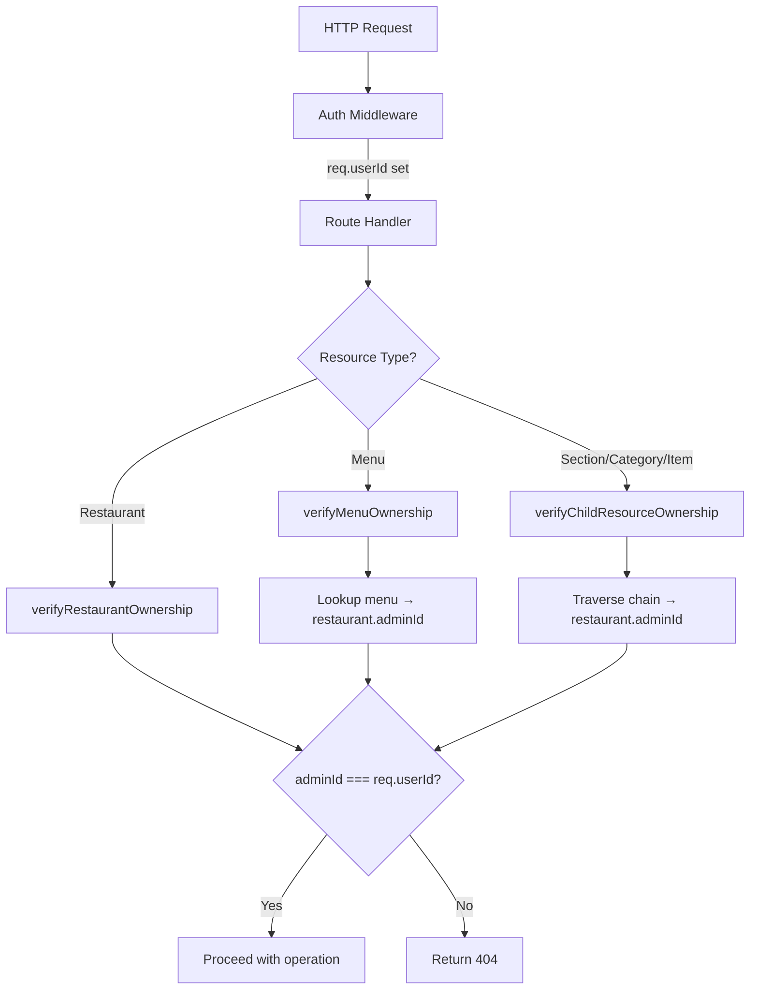
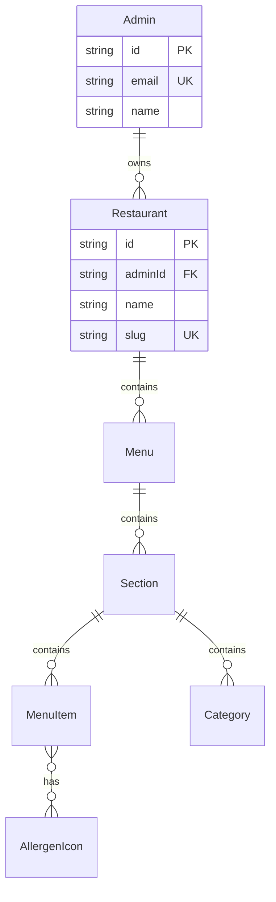

# Design Document: Multi-Tenancy

## Overview

This design adds per-admin data isolation to the menubuildr platform. Currently, all authenticated users share a single global namespace — any admin can read, modify, or delete any restaurant and its child resources. The multi-tenancy feature links each Restaurant to its owning Admin via a foreign key, then enforces ownership checks on every protected API route.

The approach is a single shared database with row-level ownership filtering (not schema-per-tenant). This is appropriate because the data model is identical across tenants and the expected tenant count is moderate.

Key design decisions:
- **404 over 403**: Ownership failures return 404 to avoid leaking resource existence to unauthorized users.
- **Centralized ownership helper**: A reusable `verifyOwnership` utility handles all ownership chain traversals, keeping route handlers clean.
- **Middleware-level auth assumed**: The design assumes `req.userId` is always a valid Admin ID. The local-admin fallback in the current auth middleware is a deployment concern addressed separately.
- **Migration safety**: Existing restaurants are assigned to the first admin user in a reversible migration.

## Architecture

The ownership enforcement follows a layered approach:



### Ownership Chain Traversal

The entity hierarchy is: `Admin → Restaurant → Menu → Section → Category/MenuItem`. For any child resource, ownership verification traverses up to the Restaurant and checks `adminId`.

| Resource Level | Traversal Path | Prisma Include |
|---|---|---|
| Restaurant | Direct `adminId` check | None |
| Menu | `menu.restaurant.adminId` | `{ restaurant: { select: { adminId: true } } }` |
| Section | `section.menu.restaurant.adminId` | `{ menu: { select: { restaurant: { select: { adminId: true } } } } }` |
| Category | `category.section.menu.restaurant.adminId` | Same depth as section + 1 |
| MenuItem | `item.section.menu.restaurant.adminId` | Same depth as section + 1 |

### Routes Not Requiring Ownership

- **Global resources**: `/api/allergens`, `/api/languages`, `/api/templates` — shared data, auth-only
- **Public endpoint**: `/menu/[restaurantSlug]/[menuSlug]` — no auth, no ownership
- **Auth routes**: `/api/auth` — login/register, no ownership concept

## Components and Interfaces

### 1. Ownership Verification Utility

New file: `server/src/middleware/ownership.ts`

```typescript
import prisma from '../config/database';

type OwnershipResult = 
  | { authorized: true; resourceId: string }
  | { authorized: false };

// Verify restaurant belongs to admin
async function verifyRestaurantOwnership(
  restaurantId: string,
  adminId: string
): Promise<OwnershipResult>;

// Verify menu's parent restaurant belongs to admin
async function verifyMenuOwnership(
  menuId: string,
  adminId: string
): Promise<OwnershipResult>;

// Verify section's ownership chain up to restaurant
async function verifySectionOwnership(
  sectionId: string,
  adminId: string
): Promise<OwnershipResult>;

// Verify menu item's ownership chain up to restaurant
async function verifyItemOwnership(
  itemId: string,
  adminId: string
): Promise<OwnershipResult>;

// Verify all items in a list belong to the admin (for bulk operations)
async function verifyBulkItemOwnership(
  itemIds: string[],
  adminId: string
): Promise<OwnershipResult>;
```

Each function queries the resource with its ownership chain included, then checks if the terminal `adminId` matches. Returns `{ authorized: false }` if the resource doesn't exist OR belongs to another admin (both return 404 to the client).

### 2. Modified Route Handlers

Each route file is updated to call the appropriate ownership function before performing its operation. The pattern is consistent:

```typescript
// Example: PUT /api/restaurants/:id
router.put('/:id', async (req: AuthRequest, res) => {
  const ownership = await verifyRestaurantOwnership(req.params.id, req.userId!);
  if (!ownership.authorized) {
    return res.status(404).json({ error: 'Restaurant not found' });
  }
  // ... proceed with update
});
```

### 3. Modified Auth Middleware

The `authenticateToken` middleware must be hardened to reject unauthenticated requests on protected routes instead of falling back to `'local-admin'`:

```typescript
// Current (broken for multi-tenancy):
if (!token) {
  req.userId = fallbackUserId;
  return next();
}

// Required:
if (!token) {
  return res.status(401).json({ error: 'Authentication required' });
}
```

### 4. Route-by-Route Changes Summary

| Route File | Endpoints Affected | Ownership Check |
|---|---|---|
| `restaurants.ts` | GET /, GET /:id, POST /, PUT /:id, DELETE /:id, PUT /:id/theme, PUT /:id/modules | `verifyRestaurantOwnership` (GET / uses `where: { adminId }` filter) |
| `menus.ts` | All endpoints | `verifyRestaurantOwnership` for restaurant-scoped, `verifyMenuOwnership` for menu-scoped |
| `sections.ts` | All endpoints | `verifySectionOwnership` or `verifyMenuOwnership` (for POST) |
| `categories.ts` | All endpoints | `verifySectionOwnership` (for POST), category chain check for PUT/DELETE |
| `items.ts` | All endpoints including bulk | `verifyItemOwnership`, `verifyBulkItemOwnership` for bulk ops |
| `search.ts` | GET / | Filter by admin's restaurant IDs |
| `import-export.ts` | All endpoints | `verifyRestaurantOwnership` for export/import-menu, assign `adminId` on import |
| `translations.ts` | All endpoints | `verifyItemOwnership` |
| `upload.ts` | No change needed | Uploads are file-only (Cloudinary), no resource association in current code |

## Data Models

### Schema Changes

Add `adminId` foreign key to the Restaurant model and a reverse relation on Admin:

```prisma
model Admin {
  id            String       @id @default(uuid())
  email         String       @unique
  passwordHash  String       @map("password_hash")
  name          String
  createdAt     DateTime     @default(now()) @map("created_at")
  restaurants   Restaurant[]

  @@map("admins")
}

model Restaurant {
  id              String   @id @default(uuid())
  adminId         String   @map("admin_id")
  name            String
  logoUrl         String?  @map("logo_url")
  logoPosition    String?  @map("logo_position")
  slug            String   @unique
  currency        String   @default("USD")
  defaultLanguage String   @default("ENG") @map("default_language")
  activeStatus    Boolean  @default(true) @map("active_status")
  createdAt       DateTime @default(now()) @map("created_at")
  updatedAt       DateTime @updatedAt @map("updated_at")

  admin           Admin    @relation(fields: [adminId], references: [id])
  menus           Menu[]
  themeSettings   ThemeSettings?
  moduleSettings  ModuleSettings?

  @@map("restaurants")
}
```

No changes to Menu, Section, Category, MenuItem, or any other models. The ownership chain is already established through existing foreign keys — we only need the new `adminId` on Restaurant as the root anchor.

### Migration Strategy

A two-step Prisma migration:

1. **Add nullable `admin_id` column** with a foreign key to `admins.id`
2. **Run a data migration** that assigns all existing restaurants to the first admin:
   ```sql
   UPDATE restaurants SET admin_id = (SELECT id FROM admins ORDER BY created_at ASC LIMIT 1);
   ```
3. **Alter column to NOT NULL** after data is populated

The migration must fail if no admin exists, preventing orphaned restaurants.

Rollback: drop the `admin_id` column and remove the relation from the Prisma schema.

### Entity Relationship Diagram




## Correctness Properties

*A property is a characteristic or behavior that should hold true across all valid executions of a system — essentially, a formal statement about what the system should do. Properties serve as the bridge between human-readable specifications and machine-verifiable correctness guarantees.*

### Property 1: Restaurant creation assigns ownership

*For any* authenticated admin and any valid restaurant data, creating a restaurant via the API should produce a restaurant record whose `adminId` equals the authenticated admin's ID.

**Validates: Requirements 1.3, 3.1**

### Property 2: Restaurant list returns only owned restaurants

*For any* authenticated admin, the list of restaurants returned by `GET /api/restaurants` should contain only restaurants where `adminId` matches the requesting admin's ID, and should contain all such restaurants.

**Validates: Requirements 2.1**

### Property 3: Restaurant single access requires ownership

*For any* authenticated admin and any restaurant ID, `GET /api/restaurants/:id` should return the restaurant if and only if `adminId` matches the requesting admin's ID. If the restaurant exists but belongs to a different admin, the response should be 404.

**Validates: Requirements 2.2, 2.3**

### Property 4: Restaurant mutations require ownership

*For any* authenticated admin and any restaurant, mutation operations (update, delete, theme update, module update) should succeed if and only if the restaurant's `adminId` matches the requesting admin's ID. Non-matching requests should receive a 404 response.

**Validates: Requirements 3.2, 3.3, 3.4, 3.5, 3.6**

### Property 5: Per-admin restaurant limit enforcement

*For any* authenticated admin, the restaurant creation limit should be enforced by counting only restaurants where `adminId` matches that admin's ID. An admin at the limit should receive a 400 response, while another admin below the limit should be able to create restaurants regardless of the first admin's count.

**Validates: Requirements 4.1, 4.2, 4.3**

### Property 6: Menu operations require parent restaurant ownership

*For any* authenticated admin and any menu, all menu operations (list, create, read, update, delete, duplicate, publish, preview, reorder, version history) should succeed if and only if the menu's parent restaurant has `adminId` matching the requesting admin's ID. Non-matching requests should receive a 404 response.

**Validates: Requirements 5.1, 5.2, 5.3, 5.4, 5.5, 5.6, 5.7, 5.8**

### Property 7: Section operations require ownership chain verification

*For any* authenticated admin and any section, all section operations (create, update, delete, duplicate, reorder) should succeed if and only if the section's ownership chain (section → menu → restaurant) terminates at a restaurant with `adminId` matching the requesting admin's ID. Non-matching requests should receive a 404 response.

**Validates: Requirements 6.1, 6.2, 6.3, 6.4, 6.5**

### Property 8: Item operations require ownership chain verification

*For any* authenticated admin and any menu item, all item operations (create, read, update, delete, duplicate, reorder, recipe update) should succeed if and only if the item's ownership chain (item → section → menu → restaurant) terminates at a restaurant with `adminId` matching the requesting admin's ID. Non-matching requests should receive a 404 response.

**Validates: Requirements 7.1, 7.2, 7.3, 7.6**

### Property 9: Bulk item operations require all items owned

*For any* authenticated admin and any set of item IDs, bulk operations (bulk-update, bulk-delete) should succeed if and only if every item in the set belongs to a restaurant owned by the requesting admin. If any single item in the set belongs to a different admin, the entire operation should fail with a 404 response.

**Validates: Requirements 7.4, 7.5**

### Property 10: Search returns only owned restaurant items

*For any* authenticated admin and any search query, all items returned by the search endpoint should belong to restaurants where `adminId` matches the requesting admin's ID. No items from other admins' restaurants should appear in results.

**Validates: Requirements 8.2**

### Property 11: Import/export requires restaurant ownership

*For any* authenticated admin and any restaurant, export and import-menu operations should succeed if and only if the target restaurant's `adminId` matches the requesting admin's ID. When importing a new restaurant, the `adminId` should be set to the importing admin's ID.

**Validates: Requirements 8.3**

### Property 12: Translation operations require item ownership chain

*For any* authenticated admin and any menu item, translation operations (list, create, update, delete) should succeed if and only if the item's ownership chain terminates at a restaurant with `adminId` matching the requesting admin's ID.

**Validates: Requirements 8.4**

### Property 13: Global resources accessible to all authenticated admins

*For any* two authenticated admins, the allergen icons, languages, and menu templates returned by their respective API calls should be identical. Global resource endpoints should not filter by `adminId`.

**Validates: Requirements 9.1, 9.2, 9.3**

### Property 14: Auth middleware rejects unauthenticated requests

*For any* protected route and any request without a valid JWT token, the auth middleware should return a 401 response and should not set `req.userId` to any fallback value.

**Validates: Requirements 11.1, 9.4**

### Property 15: Auth middleware extracts userId from valid token

*For any* valid JWT token containing a userId claim, the auth middleware should set `req.userId` to the value from the token.

**Validates: Requirements 11.2**

### Property 16: Auth middleware rejects invalid tokens

*For any* expired or malformed JWT token, the auth middleware should return a 401 response.

**Validates: Requirements 11.3**

### Property 17: Public menu endpoint serves without authentication

*For any* published menu, the public menu endpoint should serve the menu HTML without requiring a JWT token, resolving by restaurant slug and menu slug regardless of which admin owns the restaurant.

**Validates: Requirements 10.1, 10.2**

### Property 18: Public menu endpoint does not expose admin data

*For any* published menu, the public menu endpoint response should not contain the `adminId`, admin email, or admin name anywhere in the response body.

**Validates: Requirements 10.3**

### Property 19: Migration assigns all existing restaurants to first admin

*For any* set of existing restaurant records and at least one existing admin record, after running the migration, every restaurant should have `adminId` set to the first admin's ID (ordered by `created_at`).

**Validates: Requirements 12.2**


## Error Handling

### HTTP Status Code Strategy

| Scenario | Status Code | Response Body |
|---|---|---|
| No JWT token provided | 401 | `{ "error": "Authentication required" }` |
| Expired/malformed JWT | 401 | `{ "error": "Invalid or expired token" }` |
| Resource not found (genuine) | 404 | `{ "error": "<Resource> not found" }` |
| Resource exists but not owned | 404 | `{ "error": "<Resource> not found" }` |
| Restaurant limit exceeded | 400 | `{ "error": "Maximum N restaurants allowed" }` |
| Bulk op with mixed ownership | 404 | `{ "error": "One or more items not found" }` |
| Validation error | 400 | `{ "error": "Validation error", "details": "..." }` |
| Server error | 500 | `{ "error": "Internal server error" }` |

### Design Rationale: 404 over 403

Returning 404 instead of 403 for ownership failures is a deliberate security decision. A 403 response confirms the resource exists, which leaks information to unauthorized users. By returning 404, the API behaves identically whether the resource doesn't exist or belongs to another admin.

### Bulk Operation Error Handling

For `bulk-update` and `bulk-delete`, the ownership check must verify ALL items before performing any operation. If any item fails the ownership check:
1. No items are modified/deleted (atomic behavior)
2. A 404 response is returned
3. The response does not indicate which specific items failed (to avoid information leakage)

### Migration Error Handling

- If no Admin record exists when the migration runs, the migration should throw an error and roll back, leaving the database unchanged.
- The migration uses a transaction to ensure atomicity: either all restaurants get assigned or none do.

## Testing Strategy

### Property-Based Testing

Property-based tests use **fast-check** (the standard PBT library for TypeScript/Node.js) to validate the correctness properties defined above.

Each property test:
- Runs a minimum of 100 iterations with randomly generated inputs
- References its design property with a tag comment
- Uses arbitraries to generate random admin IDs, restaurant data, and resource hierarchies

```typescript
// Example tag format:
// Feature: multi-tenancy, Property 2: Restaurant list returns only owned restaurants
```

Property tests focus on the ownership verification logic and route-level behavior:
- Generate random admin/restaurant ownership configurations
- Call API endpoints with different admin contexts
- Assert that responses match ownership rules

### Unit Tests

Unit tests complement property tests by covering:
- Specific examples of ownership verification (owned vs. not-owned)
- Edge cases: empty restaurant list, single admin, bulk operations with empty arrays
- Migration behavior: no admin exists, single admin, multiple admins
- Auth middleware: missing token, expired token, valid token, malformed token
- Integration points: ownership helper functions with Prisma queries

### Test Organization

```
server/src/__tests__/
  ownership.test.ts          — Unit + property tests for verifyOwnership helpers
  ownership.property.test.ts — Property-based tests for ownership verification
  restaurants.test.ts        — Route-level tests for restaurant endpoints
  menus.test.ts              — Route-level tests for menu endpoints
  auth-middleware.test.ts    — Tests for hardened auth middleware
  migration.test.ts          — Migration behavior tests
```

### Key Testing Considerations

- Property tests for ownership verification (Properties 2-12) can share a common test setup that creates multiple admins with interleaved restaurants
- The `verifyOwnership` helper functions are pure database queries, making them straightforward to test with a test database
- Bulk operation tests (Property 9) need to test the "all or nothing" behavior with mixed-ownership item sets
- Auth middleware tests (Properties 14-16) can use mock request/response objects without a database
- Public endpoint tests (Properties 17-18) verify the absence of auth requirements and admin data leakage
