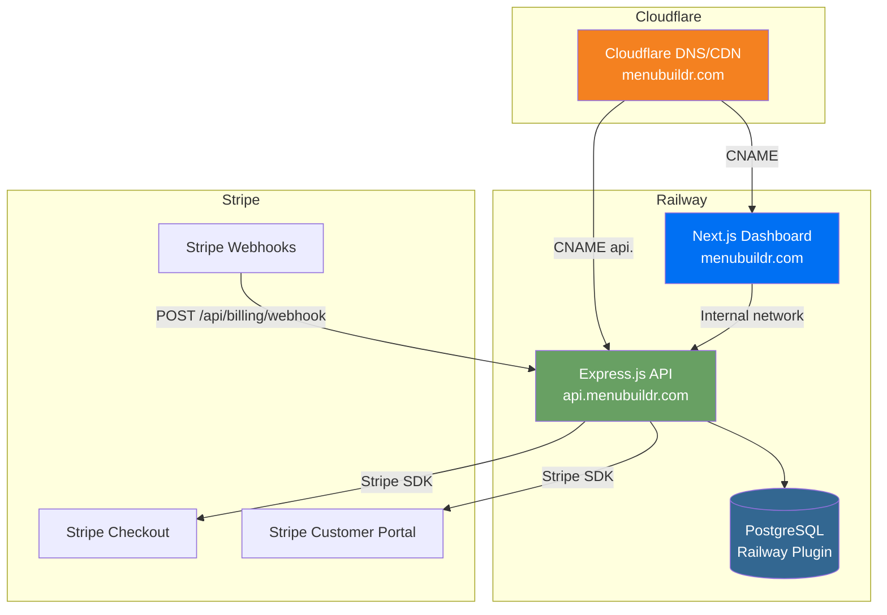
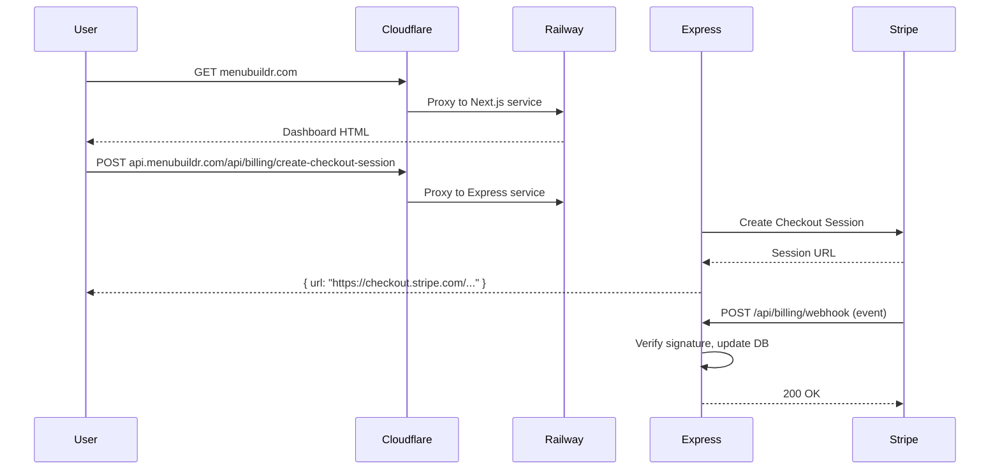
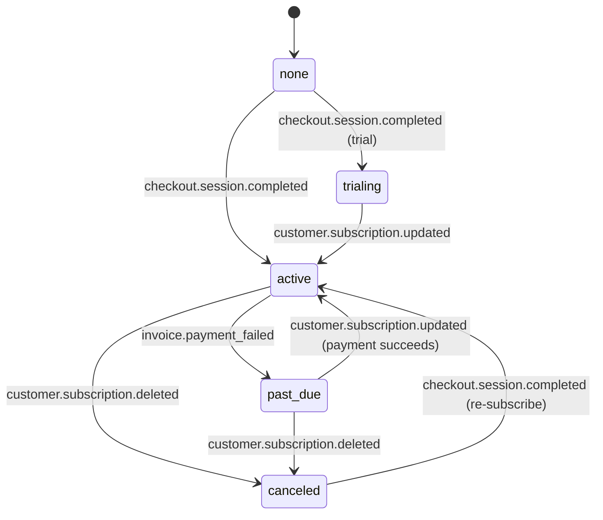

# Design Document: Stripe Subscriptions and Deployment

## Overview

This design covers two interconnected capabilities for menubuildr.com: production deployment on Railway and Stripe subscription billing. The system currently runs locally with an Express.js backend (TypeScript, Prisma, PostgreSQL) and a Next.js 16 dashboard. The deployment architecture uses Railway as the PaaS host for three services (backend, frontend, PostgreSQL) with Cloudflare acting as DNS proxy and CDN in front of the `menubuildr.com` domain. Stripe integration adds a billing service layer that manages subscription lifecycle through checkout sessions, webhooks, and a customer portal.

The key architectural decisions are:
- **Railway over Cloudflare Workers**: Express.js requires a Node.js runtime, incompatible with Cloudflare Workers' V8 isolates
- **Subdomain split**: `menubuildr.com` serves the Next.js dashboard, `api.menubuildr.com` serves the Express.js API
- **Stripe Checkout + Customer Portal**: Offloads PCI compliance and billing UI to Stripe's hosted pages
- **Webhook-driven state sync**: Subscription status is updated via Stripe webhooks, not polling

## Architecture

### Deployment Topology



### Railway Service Configuration

| Service | Build Command | Start Command | Port |
|---------|--------------|---------------|------|
| Backend (Express) | `npm run build && npx prisma migrate deploy` | `npm start` | `$PORT` (Railway-assigned) |
| Frontend (Next.js) | `npm run build` | `npm start` | `$PORT` (Railway-assigned) |
| PostgreSQL | Railway Plugin (managed) | — | Auto-assigned |

### Cloudflare DNS Records

| Type | Name | Target | Proxy |
|------|------|--------|-------|
| CNAME | `@` | `<railway-frontend-domain>.up.railway.app` | Proxied (orange cloud) |
| CNAME | `www` | `<railway-frontend-domain>.up.railway.app` | Proxied |
| CNAME | `api` | `<railway-backend-domain>.up.railway.app` | Proxied |

SSL mode: **Full (Strict)** — Railway provides valid TLS certificates, Cloudflare terminates SSL on the edge.

### Request Flow




## Components and Interfaces

### 1. Backend Production Hardening (`server/src/server.ts` modifications)

The existing `server.ts` needs several production-readiness changes:

**CORS lockdown**: Replace `origin: true` with an allowlist derived from `FRONTEND_URL`:
```typescript
const allowedOrigins = process.env.NODE_ENV === 'production'
  ? [process.env.FRONTEND_URL, `https://api.menubuildr.com`]
  : ['http://localhost:3000', 'http://localhost:3001', /* ... dev ports */];

app.use(cors({ origin: allowedOrigins, credentials: true }));
```

**Trust proxy**: Add `app.set('trust proxy', 1)` so Express correctly reads `X-Forwarded-*` headers from Cloudflare.

**Raw body for webhooks**: Register the webhook route with `express.raw()` *before* the global `express.json()` middleware, or use a conditional middleware:
```typescript
app.use('/api/billing/webhook', express.raw({ type: 'application/json' }));
app.use(express.json({ limit: '10mb' }));
```

**Environment validation**: On startup, validate required env vars and exit if missing in production.

**Health check enhancement**: The existing `GET /api/health` endpoint is kept. Optionally add a DB ping.

### 2. Auth Middleware Production Mode (`server/src/middleware/auth.ts`)

The current middleware has a `local-admin` fallback that bypasses authentication entirely. In production:

- If no token is provided, return `401 Unauthorized`
- If token verification fails, return `401 Unauthorized`
- The fallback behavior is preserved only when `NODE_ENV !== 'production'`

```typescript
export const authenticateToken = (req: AuthRequest, res: Response, next: NextFunction) => {
  const token = req.headers['authorization']?.split(' ')[1];
  const isProduction = process.env.NODE_ENV === 'production';

  if (!token) {
    if (isProduction) return res.status(401).json({ error: 'Authentication required' });
    req.userId = 'local-admin';
    return next();
  }

  try {
    const decoded = jwt.verify(token, process.env.JWT_SECRET!) as { userId: string };
    req.userId = decoded.userId;
    return next();
  } catch {
    if (isProduction) return res.status(401).json({ error: 'Invalid token' });
    req.userId = 'local-admin';
    return next();
  }
};
```

### 3. Billing Routes (`server/src/routes/billing.ts` — new file)

Three endpoints behind `authenticateToken`:

| Method | Path | Auth | Description |
|--------|------|------|-------------|
| POST | `/api/billing/create-checkout-session` | JWT | Creates Stripe Checkout Session |
| POST | `/api/billing/create-portal-session` | JWT | Creates Stripe Customer Portal Session |
| POST | `/api/billing/webhook` | None (signature verified) | Receives Stripe webhook events |

**`POST /api/billing/create-checkout-session`**:
1. Look up Admin by `req.userId`
2. If no `stripeCustomerId`, create a Stripe Customer with the Admin's email, store the ID
3. Create a Checkout Session in `subscription` mode with the `STRIPE_PRICE_ID`
4. Set `success_url` to `{FRONTEND_URL}/dashboard/billing?session_id={CHECKOUT_SESSION_ID}`
5. Set `cancel_url` to `{FRONTEND_URL}/dashboard/billing`
6. Return `{ url: session.url }`

**`POST /api/billing/create-portal-session`**:
1. Look up Admin by `req.userId`
2. If no `stripeCustomerId`, return 400
3. Create a Billing Portal Session with `return_url` = `{FRONTEND_URL}/dashboard/billing`
4. Return `{ url: session.url }`

**`POST /api/billing/webhook`**:
1. Read raw body and `stripe-signature` header
2. Call `stripe.webhooks.constructEvent(rawBody, sig, STRIPE_WEBHOOK_SECRET)`
3. Handle events: `checkout.session.completed`, `customer.subscription.updated`, `customer.subscription.deleted`, `invoice.payment_failed`
4. Return 200

### 4. Subscription Guard Middleware (`server/src/middleware/subscription.ts` — new file)

A middleware that runs after `authenticateToken` on protected routes:

```typescript
export const requireSubscription = async (req: AuthRequest, res: Response, next: NextFunction) => {
  const admin = await prisma.admin.findUnique({ where: { id: req.userId } });
  if (!admin) return res.status(401).json({ error: 'Admin not found' });

  if (admin.subscriptionStatus === 'active' || admin.subscriptionStatus === 'trialing') {
    return next();
  }

  return res.status(403).json({
    error: 'Subscription required',
    code: 'SUBSCRIPTION_REQUIRED',
    subscriptionStatus: admin.subscriptionStatus,
  });
};
```

**Exempt routes** (no subscription check): `/api/auth/*`, `/api/billing/*`, `/api/health`

The guard is applied in `server.ts` as a route-level middleware on all other `/api/*` routes.

### 5. Billing Service (`server/src/services/billing.ts` — new file)

Encapsulates Stripe SDK interactions:

- `getOrCreateStripeCustomer(adminId: string): Promise<string>` — returns `stripeCustomerId`
- `createCheckoutSession(customerId: string, priceId: string, urls: { success: string; cancel: string }): Promise<string>` — returns session URL
- `createPortalSession(customerId: string, returnUrl: string): Promise<string>` — returns portal URL
- `handleWebhookEvent(event: Stripe.Event): Promise<void>` — processes webhook events and updates DB

### 6. Environment Validator (`server/src/config/env.ts` — new file)

```typescript
const REQUIRED_VARS = ['DATABASE_URL', 'JWT_SECRET', 'STRIPE_SECRET_KEY', 'STRIPE_WEBHOOK_SECRET', 'STRIPE_PRICE_ID'];

export function validateEnv(): void {
  if (process.env.NODE_ENV !== 'production') return;
  const missing = REQUIRED_VARS.filter(v => !process.env[v]);
  if (missing.length > 0) {
    console.error(`Missing required environment variables: ${missing.join(', ')}`);
    process.exit(1);
  }
}
```

### 7. Dashboard Billing Page (`dashboard/app/dashboard/billing/page.tsx` — new file)

A React page that:
- Fetches the Admin's subscription status from `GET /api/auth/me` (extended to include subscription fields)
- Displays current status with appropriate UI states
- Shows "Subscribe" button (status: none/canceled) → calls `POST /api/billing/create-checkout-session` → redirects to Stripe
- Shows "Manage Subscription" button (status: active/trialing) → calls `POST /api/billing/create-portal-session` → redirects to Stripe
- Shows "Update Payment" warning (status: past_due) → opens portal
- Detects `session_id` query param and shows success message

### 8. Dashboard Subscription Guard (API client interceptor)

Extend the existing Axios response interceptor in `dashboard/lib/api/client.ts`:
- On 403 with `code: 'SUBSCRIPTION_REQUIRED'`, redirect to `/dashboard/billing`

### 9. Dashboard Navigation Update

Add a "Billing" nav item to the sidebar in `dashboard/components/layout/dashboard-layout.tsx` using the `CreditCard` icon from lucide-react.

### 10. Next.js Configuration for Production

In `next.config.ts`:
- Add rewrite rule: `/uploads/:path*` → `${NEXT_PUBLIC_API_URL}/uploads/:path*` (proxies upload assets to backend)
- Set `output: 'standalone'` for optimized Railway deployment (optional, reduces image size)


## Data Models

### Prisma Schema Changes (Admin model)

```prisma
model Admin {
  id                    String   @id @default(uuid())
  email                 String   @unique
  passwordHash          String   @map("password_hash")
  name                  String
  stripeCustomerId      String?  @unique @map("stripe_customer_id")
  stripeSubscriptionId  String?  @map("stripe_subscription_id")
  subscriptionStatus    String   @default("none") @map("subscription_status")
  subscriptionPlan      String?  @map("subscription_plan")
  createdAt             DateTime @default(now()) @map("created_at")

  @@map("admins")
}
```

**New fields:**
| Field | Type | Constraint | Default | Description |
|-------|------|-----------|---------|-------------|
| `stripeCustomerId` | `String?` | `@unique` | `null` | Stripe Customer ID (cus_xxx) |
| `stripeSubscriptionId` | `String?` | — | `null` | Active Stripe Subscription ID (sub_xxx) |
| `subscriptionStatus` | `String` | — | `"none"` | One of: `none`, `active`, `past_due`, `canceled`, `trialing` |
| `subscriptionPlan` | `String?` | — | `null` | Stripe Price ID of the active plan |

**Migration behavior**: The migration adds nullable columns with defaults, so existing Admin records get `subscriptionStatus = "none"` and null for the other fields. No data loss.

### Subscription Status State Machine



### Environment Variables

| Variable | Service | Required | Description |
|----------|---------|----------|-------------|
| `DATABASE_URL` | Backend | Yes | PostgreSQL connection string (Railway provides this) |
| `JWT_SECRET` | Backend | Yes | Secret for signing JWT tokens |
| `STRIPE_SECRET_KEY` | Backend | Yes | Stripe secret API key (sk_live_xxx) |
| `STRIPE_WEBHOOK_SECRET` | Backend | Yes | Stripe webhook signing secret (whsec_xxx) |
| `STRIPE_PRICE_ID` | Backend | Yes | Stripe Price ID for the subscription plan |
| `FRONTEND_URL` | Backend | Yes | `https://menubuildr.com` |
| `NODE_ENV` | Both | Yes | `production` |
| `NEXT_PUBLIC_API_URL` | Frontend | Yes | `https://api.menubuildr.com/api` |
| `NEXT_PUBLIC_STRIPE_PUBLISHABLE_KEY` | Frontend | Yes | Stripe publishable key (pk_live_xxx) |
| `PORT` | Both | Auto | Railway assigns this automatically |


## Correctness Properties

*A property is a characteristic or behavior that should hold true across all valid executions of a system — essentially, a formal statement about what the system should do. Properties serve as the bridge between human-readable specifications and machine-verifiable correctness guarantees.*

### Property 1: CORS origin filtering

*For any* HTTP origin string, the CORS middleware in production mode should allow the request if and only if the origin is in the configured allowlist (`menubuildr.com`, `www.menubuildr.com`, `api.menubuildr.com`). All other origins should be rejected.

**Validates: Requirements 3.2**

### Property 2: Auth middleware rejects unauthenticated requests in production

*For any* request to a protected route without a valid JWT token, when `NODE_ENV` is `production`, the auth middleware should return HTTP 401. For any request with a valid JWT token, the middleware should extract the `userId` and pass it through.

**Validates: Requirements 3.3**

### Property 3: Stripe customer ID management during checkout

*For any* Admin, when creating a checkout session: if the Admin has no `stripeCustomerId`, a new Stripe Customer should be created and stored; if the Admin already has a `stripeCustomerId`, the existing ID should be reused. In both cases, the checkout session should be attached to the correct customer ID.

**Validates: Requirements 6.2, 6.3, 7.4**

### Property 4: Checkout session creation returns a redirect URL

*For any* authenticated Admin, calling `POST /api/billing/create-checkout-session` should return a response containing a non-empty `url` string pointing to a Stripe Checkout page, with the session created in `subscription` mode.

**Validates: Requirements 7.1, 7.5**

### Property 5: Webhook event updates subscription status correctly

*For any* valid Stripe webhook event with a matching customer in the database:
- `checkout.session.completed` → `subscriptionStatus` becomes `"active"` and `stripeSubscriptionId` is stored
- `customer.subscription.updated` → `subscriptionStatus` mirrors the Stripe subscription's status
- `customer.subscription.deleted` → `subscriptionStatus` becomes `"canceled"` and `stripeSubscriptionId` is cleared
- `invoice.payment_failed` → `subscriptionStatus` becomes `"past_due"`

**Validates: Requirements 8.4, 8.5, 8.6, 8.7**

### Property 6: Webhook signature verification

*For any* incoming POST request to `/api/billing/webhook`, the handler should verify the `stripe-signature` header against the raw request body using `STRIPE_WEBHOOK_SECRET`. If verification fails, the handler should return HTTP 400 and not process the event.

**Validates: Requirements 8.2, 8.3**

### Property 7: Subscription guard allows or blocks based on status

*For any* authenticated Admin and any protected API route, the subscription guard should allow the request through if `subscriptionStatus` is `"active"` or `"trialing"`, and return HTTP 403 with `code: "SUBSCRIPTION_REQUIRED"` if `subscriptionStatus` is `"none"`, `"canceled"`, or `"past_due"`.

**Validates: Requirements 9.1, 9.2, 9.3**

### Property 8: Subscription guard exempts auth, billing, and health routes

*For any* request to a route matching `/api/auth/*`, `/api/billing/*`, or `/api/health`, the subscription guard should not block the request regardless of the Admin's `subscriptionStatus`.

**Validates: Requirements 9.4**

### Property 9: Portal session requires existing Stripe customer

*For any* authenticated Admin, calling `POST /api/billing/create-portal-session` should return a portal URL if the Admin has a `stripeCustomerId`, and return HTTP 400 if the Admin does not have a `stripeCustomerId`.

**Validates: Requirements 10.1, 10.3, 10.4**

### Property 10: Billing page renders correct UI for subscription status

*For any* subscription status value (`none`, `active`, `past_due`, `canceled`, `trialing`), the billing page should render the appropriate UI elements: "Subscribe" button for `none`/`canceled`, "Manage Subscription" button for `active`/`trialing`, and "Update Payment" warning for `past_due`.

**Validates: Requirements 11.2, 11.3, 11.4, 11.5**

### Property 11: Unique Stripe customer ID constraint

*For any* two distinct Admin records, they should not be able to share the same non-null `stripeCustomerId` value. Attempting to assign a duplicate `stripeCustomerId` should result in a database constraint violation.

**Validates: Requirements 12.4**

### Property 12: Environment validation on startup

*For any* subset of the required environment variables (`DATABASE_URL`, `JWT_SECRET`, `STRIPE_SECRET_KEY`, `STRIPE_WEBHOOK_SECRET`, `STRIPE_PRICE_ID`) that is missing when `NODE_ENV` is `production`, the startup validator should log the missing variable names and exit with a non-zero code.

**Validates: Requirements 14.1, 14.2**


## Error Handling

### Backend Errors

| Scenario | Response | Action |
|----------|----------|--------|
| Missing JWT token (production) | 401 `{ error: "Authentication required" }` | Client redirects to login |
| Invalid/expired JWT token (production) | 401 `{ error: "Invalid token" }` | Client clears token, redirects to login |
| Subscription not active | 403 `{ error: "Subscription required", code: "SUBSCRIPTION_REQUIRED" }` | Client redirects to billing page |
| Stripe Checkout creation fails | 500 `{ error: "Failed to create checkout session" }` | Client shows error toast |
| Stripe Portal creation fails | 500 `{ error: "Failed to create portal session" }` | Client shows error toast |
| No Stripe customer for portal | 400 `{ error: "No billing account exists" }` | Client shows subscribe prompt |
| Webhook signature invalid | 400 `{ error: "Webhook signature verification failed" }` | Log warning, Stripe retries |
| Webhook unknown event type | 200 (acknowledge) | Log info, no DB update |
| Missing env vars (production startup) | Process exits with code 1 | Railway marks deploy as failed |
| Database connection failure | Process exits with code 1 | Railway restarts service |

### Webhook Resilience

- Stripe retries failed webhook deliveries for up to 3 days with exponential backoff
- The webhook handler is idempotent: processing the same event twice produces the same result (upsert by `stripeCustomerId`)
- Unknown event types are acknowledged with 200 to prevent Stripe from retrying them
- The handler logs all received events for debugging

### Frontend Error Handling

- 401 responses: clear auth token, redirect to `/login`
- 403 with `SUBSCRIPTION_REQUIRED`: redirect to `/dashboard/billing`
- Network errors: show toast notification with retry suggestion
- Stripe redirect failures: billing page shows error state with retry button

## Testing Strategy

### Property-Based Testing

**Library**: [fast-check](https://github.com/dubzzz/fast-check) for TypeScript property-based testing.

Each correctness property from the design is implemented as a single property-based test with a minimum of 100 iterations. Tests are tagged with comments referencing the design property.

**Tag format**: `Feature: stripe-subscriptions-and-deployment, Property {number}: {property_text}`

Property tests focus on:
- Subscription guard logic (Property 7, 8): Generate random admin records with random subscription statuses and random route paths, verify allow/block behavior
- Webhook event processing (Property 5): Generate random webhook event payloads with valid structure, verify correct status transitions
- CORS filtering (Property 1): Generate random origin strings, verify allow/reject against allowlist
- Auth middleware (Property 2): Generate random tokens (valid/invalid/missing), verify 401 vs pass-through
- Customer ID management (Property 3): Generate random admin states (with/without customer ID), verify correct behavior
- Environment validation (Property 12): Generate random subsets of required env vars, verify exit behavior
- Billing page rendering (Property 10): Generate random subscription statuses, verify correct UI elements

### Unit Testing

Unit tests complement property tests for specific examples and edge cases:

- Checkout session creation with correct URLs (success/cancel URL format)
- Portal session return URL format
- Webhook handler returns 200 for unknown event types
- Health check endpoint returns expected JSON shape
- Auth middleware fallback behavior in development mode
- Billing page success message when `session_id` query param is present
- Unique constraint violation on duplicate `stripeCustomerId`

### Integration Testing

- End-to-end checkout flow with Stripe test mode
- Webhook delivery and DB update cycle
- Auth → Subscription Guard → Route handler chain
- CORS preflight requests from allowed and disallowed origins

### Test Configuration

```typescript
// Example property test structure
import fc from 'fast-check';

// Feature: stripe-subscriptions-and-deployment, Property 7: Subscription guard allows or blocks based on status
describe('Subscription Guard', () => {
  it('should allow active/trialing and block none/canceled/past_due', () => {
    const allowedStatuses = ['active', 'trialing'];
    const blockedStatuses = ['none', 'canceled', 'past_due'];
    const allStatuses = [...allowedStatuses, ...blockedStatuses];

    fc.assert(
      fc.property(
        fc.constantFrom(...allStatuses),
        fc.string(), // route path
        (status, route) => {
          // Test guard behavior for this status
          const result = evaluateGuard(status, `/api/restaurants/${route}`);
          if (allowedStatuses.includes(status)) {
            expect(result.allowed).toBe(true);
          } else {
            expect(result.statusCode).toBe(403);
            expect(result.body.code).toBe('SUBSCRIPTION_REQUIRED');
          }
        }
      ),
      { numRuns: 100 }
    );
  });
});
```

### Mocking Strategy

- **Stripe SDK**: Mock `stripe.checkout.sessions.create`, `stripe.billingPortal.sessions.create`, `stripe.customers.create`, and `stripe.webhooks.constructEvent` in tests
- **Prisma**: Use Prisma's mock client or in-memory SQLite for database operations in unit/property tests
- **Environment**: Use `process.env` manipulation in tests for env validation testing
