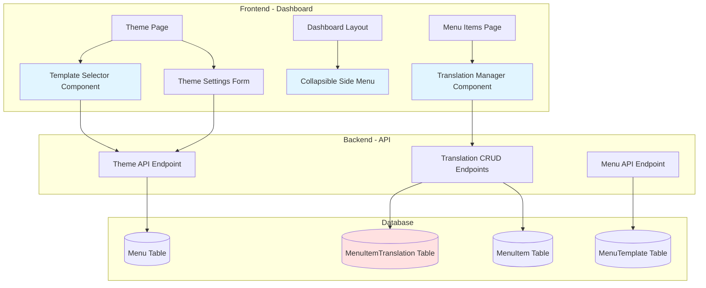

# Design Document: Theme Template Selector and Collapsible Menu

## Overview

This design document specifies the technical implementation for three enhancements to the Multi-Restaurant Menu Management System:

1. **Template Selector Component**: Enables users to select which template (Classic, Card-Based, or CoraFlow) to customize in the theme customization page
2. **Collapsible Side Navigation**: Provides a toggle mechanism for the dashboard side menu to maximize screen space
3. **Translation Management System**: Allows manual translation of menu items and descriptions into multiple languages

### Design Goals

- Seamless integration with existing theme customization workflow
- Persistent template selection per menu
- Smooth, animated transitions for collapsible menu
- Scalable translation data model supporting 10+ languages
- Minimal disruption to existing codebase

### Key Technical Decisions

**Template Selection Strategy**: Store template selection in `Menu.templateId` field (already exists in schema) and pass as query parameter to theme API endpoint. This allows each menu to have its own template selection while maintaining backward compatibility.

**Side Menu State Management**: Use React Context API with localStorage persistence to maintain collapsed/expanded state across page navigation within the same browser session.

**Translation Data Model**: Create new `MenuItemTranslation` table with composite unique constraint on `(menuItemId, languageCode)` to ensure one translation per language per item. Use cascade delete to maintain referential integrity.

## Architecture

### System Components



### Data Flow

#### Template Selection Flow
1. User selects restaurant and menu in Theme Page
2. Theme Page fetches available templates from `/api/templates` endpoint
3. User selects template from Template Selector dropdown
4. Selected template ID stored in component state
5. On save, theme settings + templateId sent to `PUT /restaurants/:id/theme?menuId=X`
6. Backend updates `Menu.templateId` and `Menu.themeSettings` JSON field
7. Preview iframe reloads with new template applied

#### Side Menu Collapse Flow
1. User clicks toggle button in DashboardLayout
2. React state updates `sidebarOpen` boolean
3. CSS transition animates width change (w-64 → w-16)
4. State persisted to localStorage as `dashboard_sidebar_collapsed`
5. On page load, state restored from localStorage
6. Main content area adjusts width automatically via flexbox

#### Translation Management Flow
1. User navigates to Menu Items page and selects an item
2. Translation Manager component fetches existing translations via `GET /menu-items/:id/translations`
3. User clicks "Add Translation" and selects language code
4. User enters translated name and description
5. On save, `POST /menu-items/:id/translations` creates new translation record
6. Frontend updates local state and displays new translation
7. When menu is rendered, template queries translations and displays matching language

## Components and Interfaces

### Frontend Components

#### 1. TemplateSelector Component

**Location**: `dashboard/components/theme/template-selector.tsx`

**Props**:
```typescript
interface TemplateSelectorProps {
  selectedTemplateId: string | null;
  onTemplateChange: (templateId: string) => void;
  disabled?: boolean;
}
```

**State**:
```typescript
interface TemplateSelectorState {
  templates: MenuTemplate[];
  loading: boolean;
  error: string | null;
}
```

**Behavior**:
- Fetches available templates on mount from `/api/templates`
- Displays templates in a Select dropdown with preview thumbnails
- Emits `onTemplateChange` event when selection changes
- Shows loading state while fetching templates
- Displays error message if fetch fails

**UI Structure**:
```tsx
<div className="space-y-2">
  <Label>Template</Label>
  <Select value={selectedTemplateId} onValueChange={onTemplateChange}>
    <SelectTrigger>
      <SelectValue placeholder="Select a template" />
    </SelectTrigger>
    <SelectContent>
      {templates.map(template => (
        <SelectItem key={template.id} value={template.id}>
          <div className="flex items-center gap-2">
            
            <span>{template.name.ENG}</span>
          </div>
        </SelectItem>
      ))}
    </SelectContent>
  </Select>
</div>
```

#### 2. CollapsibleSideMenu (Enhanced DashboardLayout)

**Location**: `dashboard/components/layout/dashboard-layout.tsx` (existing file, to be enhanced)

**Additional State**:
```typescript
const [sidebarOpen, setSidebarOpen] = useState(true); // Already exists
// Add localStorage persistence
useEffect(() => {
  const saved = localStorage.getItem('dashboard_sidebar_collapsed');
  if (saved !== null) {
    setSidebarOpen(saved === 'false' ? false : true);
  }
}, []);

useEffect(() => {
  localStorage.setItem('dashboard_sidebar_collapsed', String(sidebarOpen));
}, [sidebarOpen]);
```

**CSS Enhancements**:
- Add smooth transition: `transition-all duration-300 ease-in-out`
- Collapsed width: `w-16` (already implemented)
- Expanded width: `w-64` (already implemented)
- Hide text labels when collapsed (already implemented)
- Center icons when collapsed

#### 3. TranslationManager Component

**Location**: `dashboard/components/menu-items/translation-manager.tsx`

**Props**:
```typescript
interface TranslationManagerProps {
  menuItemId: string;
  originalName: Record<string, string>; // Multi-language JSON
  originalDescription: Record<string, string>; // Multi-language JSON
}
```

**State**:
```typescript
interface TranslationManagerState {
  translations: MenuItemTranslation[];
  loading: boolean;
  editingTranslation: MenuItemTranslation | null;
  showAddDialog: boolean;
  selectedLanguage: string;
  translatedName: string;
  translatedDescription: string;
}

interface MenuItemTranslation {
  id: string;
  menuItemId: string;
  languageCode: string;
  translatedName: string;
  translatedDescription: string;
  createdAt: string;
  updatedAt: string;
}
```

**UI Structure**:
```tsx
<Card>
  <CardHeader>
    <CardTitle>Translations</CardTitle>
    <Button onClick={() => setShowAddDialog(true)}>
      <Plus /> Add Translation
    </Button>
  </CardHeader>
  <CardContent>
    <Table>
      <TableHeader>
        <TableRow>
          <TableHead>Language</TableHead>
          <TableHead>Translated Name</TableHead>
          <TableHead>Actions</TableHead>
        </TableRow>
      </TableHeader>
      <TableBody>
        {translations.map(translation => (
          <TableRow key={translation.id}>
            <TableCell>{translation.languageCode}</TableCell>
            <TableCell>{translation.translatedName}</TableCell>
            <TableCell>
              <Button onClick={() => handleEdit(translation)}>Edit</Button>
              <Button onClick={() => handleDelete(translation.id)}>Delete</Button>
            </TableCell>
          </TableRow>
        ))}
      </TableBody>
    </Table>
  </CardContent>
</Card>

<Dialog open={showAddDialog} onOpenChange={setShowAddDialog}>
  <DialogContent>
    <DialogHeader>
      <DialogTitle>Add Translation</DialogTitle>
    </DialogHeader>
    <div className="space-y-4">
      <Select value={selectedLanguage} onValueChange={setSelectedLanguage}>
        <SelectTrigger>
          <SelectValue placeholder="Select language" />
        </SelectTrigger>
        <SelectContent>
          <SelectItem value="en">English</SelectItem>
          <SelectItem value="es">Spanish</SelectItem>
          <SelectItem value="fr">French</SelectItem>
          {/* ... more languages */}
        </SelectContent>
      </Select>
      <Input
        label="Translated Name"
        value={translatedName}
        onChange={(e) => setTranslatedName(e.target.value)}
      />
      <Textarea
        label="Translated Description"
        value={translatedDescription}
        onChange={(e) => setTranslatedDescription(e.target.value)}
      />
    </div>
    <DialogFooter>
      <Button onClick={handleSaveTranslation}>Save</Button>
    </DialogFooter>
  </DialogContent>
</Dialog>
```

### Backend API Endpoints

#### 1. Template Endpoints

**GET /api/templates**
- Returns list of all active templates
- Response:
```typescript
{
  templates: Array<{
    id: string;
    slug: string;
    name: Record<string, string>;
    description: Record<string, string>;
    previewImageUrl: string;
    version: string;
    isActive: boolean;
  }>
}
```

#### 2. Enhanced Theme Endpoint

**PUT /restaurants/:id/theme**
- Enhanced to accept `templateId` in request body
- Request body:
```typescript
{
  menuId: string;
  templateId: string; // NEW
  primaryColor: string;
  secondaryColor: string;
  // ... other theme settings
}
```
- Updates both `Menu.templateId` and `Menu.themeSettings`
- Response: Updated theme settings with confirmation

#### 3. Translation CRUD Endpoints

**GET /menu-items/:id/translations**
- Returns all translations for a menu item
- Response:
```typescript
{
  translations: Array<{
    id: string;
    menuItemId: string;
    languageCode: string;
    translatedName: string;
    translatedDescription: string;
    createdAt: string;
    updatedAt: string;
  }>
}
```

**POST /menu-items/:id/translations**
- Creates a new translation
- Request body:
```typescript
{
  languageCode: string;
  translatedName: string;
  translatedDescription: string;
}
```
- Validates unique constraint on (menuItemId, languageCode)
- Response: Created translation object

**PUT /menu-items/:menuItemId/translations/:translationId**
- Updates an existing translation
- Request body:
```typescript
{
  translatedName: string;
  translatedDescription: string;
}
```
- Response: Updated translation object

**DELETE /menu-items/:menuItemId/translations/:translationId**
- Deletes a translation
- Response: Success confirmation

## Data Models

### Database Schema Changes

#### New Table: MenuItemTranslation

```prisma
model MenuItemTranslation {
  id                    String   @id @default(uuid())
  menuItemId            String   @map("menu_item_id")
  languageCode          String   @map("language_code") // ISO 639-1 codes: en, es, fr, etc.
  translatedName        String   @map("translated_name")
  translatedDescription String?  @map("translated_description") @db.Text
  createdAt             DateTime @default(now()) @map("created_at")
  updatedAt             DateTime @updatedAt @map("updated_at")

  menuItem MenuItem @relation(fields: [menuItemId], references: [id], onDelete: Cascade)

  @@unique([menuItemId, languageCode])
  @@map("menu_item_translations")
}
```

**Key Design Decisions**:
- `languageCode` uses ISO 639-1 standard (2-letter codes)
- Composite unique constraint prevents duplicate translations per language
- Cascade delete ensures translations are removed when menu item is deleted
- `translatedDescription` is optional (nullable) to support items with no description
- Separate from existing `MenuItem.name` and `MenuItem.description` JSON fields for better queryability

#### Enhanced Menu Model

The `Menu` model already has the `templateId` field:
```prisma
model Menu {
  // ... existing fields
  templateId  String?  @map("template_id")
  template    MenuTemplate? @relation(fields: [templateId], references: [id], onDelete: SetNull)
  // ... existing fields
}
```

**No schema changes needed** - the field already exists and is properly configured.

#### Enhanced MenuItem Model

Add relation to translations:
```prisma
model MenuItem {
  // ... existing fields
  translations MenuItemTranslation[]
  // ... existing fields
}
```

### API Request/Response Types

#### ThemeSettingsRequest
```typescript
interface ThemeSettingsRequest {
  menuId?: string;
  templateId?: string; // NEW
  primaryColor: string;
  secondaryColor: string;
  accentColor: string;
  backgroundColor: string;
  textColor: string;
  customCss?: string;
  customFontsUrls: string[];
  backgroundIllustrationUrl?: string;
  coverPhotoUrl?: string;
  coverPhotoPosition?: string;
  coverPhotoSize?: string;
  logoSize?: number;
  sectionFontFamily?: string;
  sectionFontSize?: number;
  sectionBackgroundColor?: string;
}
```

#### TranslationRequest
```typescript
interface CreateTranslationRequest {
  languageCode: string;
  translatedName: string;
  translatedDescription?: string;
}

interface UpdateTranslationRequest {
  translatedName: string;
  translatedDescription?: string;
}
```

#### TranslationResponse
```typescript
interface TranslationResponse {
  id: string;
  menuItemId: string;
  languageCode: string;
  translatedName: string;
  translatedDescription: string | null;
  createdAt: string;
  updatedAt: string;
}
```

### Frontend State Management

#### Theme Page State Enhancement
```typescript
// Add to existing ThemePage state
const [selectedTemplateId, setSelectedTemplateId] = useState<string | null>(null);
const [templates, setTemplates] = useState<MenuTemplate[]>([]);

// Load template when menu is selected
useEffect(() => {
  if (selectedMenuId && menuData) {
    setSelectedTemplateId(menuData.templateId || null);
  }
}, [selectedMenuId, menuData]);

// Include templateId in save request
const handleSave = async () => {
  const payload = {
    ...formData,
    menuId: selectedMenuId,
    templateId: selectedTemplateId, // NEW
  };
  await apiClient.put(`/restaurants/${selectedRestaurantId}/theme`, payload);
};
```

#### Sidebar State Persistence
```typescript
// In DashboardLayout component
const SIDEBAR_STORAGE_KEY = 'dashboard_sidebar_collapsed';

const [sidebarOpen, setSidebarOpen] = useState(() => {
  if (typeof window !== 'undefined') {
    const saved = localStorage.getItem(SIDEBAR_STORAGE_KEY);
    return saved === null ? true : saved === 'true';
  }
  return true;
});

useEffect(() => {
  localStorage.setItem(SIDEBAR_STORAGE_KEY, String(sidebarOpen));
}, [sidebarOpen]);
```


## Correctness Properties

*A property is a characteristic or behavior that should hold true across all valid executions of a system-essentially, a formal statement about what the system should do. Properties serve as the bridge between human-readable specifications and machine-verifiable correctness guarantees.*

### Property Reflection

After analyzing all acceptance criteria, I identified several opportunities to consolidate redundant properties:

- **Properties 3.3, 3.8, 3.9** (add, edit, delete translations) can be combined into a comprehensive CRUD property
- **Properties 2.3 and 2.4** (collapsed shows icons only, expanded shows both) can be combined into a single UI state property
- **Properties 3.6 and 3.7** (display matching translation or fallback) can be combined into a single language resolution property
- **Property 5.4** (CRUD endpoints exist) is subsumed by the individual CRUD operation properties

The following properties represent the minimal, non-redundant set needed for comprehensive validation:

### Property 1: Template Registry Completeness

*For any* set of templates registered in the Template_Registry, all templates should appear in the Template_Selector dropdown.

**Validates: Requirements 1.2**

### Property 2: Template Selection Loads Correct Settings

*For any* template selection and menu combination, loading theme settings should retrieve the settings associated with that specific template and menu.

**Validates: Requirements 1.3**

### Property 3: Template Persistence in API Requests

*For any* theme settings save operation with a selected template, the API request payload should include the templateId field matching the selected template.

**Validates: Requirements 1.6**

### Property 4: Theme Settings Association

*For any* saved theme settings, they should be correctly associated with both the selected template and menu combination in the database.

**Validates: Requirements 1.5, 4.1**

### Property 5: Sidebar Toggle Idempotence

*For any* sidebar state (collapsed or expanded), clicking the toggle button twice should return to the original state.

**Validates: Requirements 2.2**

### Property 6: Sidebar UI State Consistency

*For any* sidebar state, when collapsed the UI should display only icons, and when expanded the UI should display both icons and text labels.

**Validates: Requirements 2.3, 2.4**

### Property 7: Sidebar State Persistence Round-Trip

*For any* sidebar state (collapsed or expanded), setting the state, navigating to a different page, and returning should preserve the original state.

**Validates: Requirements 2.5**

### Property 8: Content Area Width Adjustment

*For any* sidebar state change, the main content area width should adjust inversely (sidebar expands → content shrinks, sidebar collapses → content expands).

**Validates: Requirements 2.6**

### Property 9: Translation Display Completeness

*For any* menu item with translations, accessing that menu item should display all associated translations in the translation manager interface.

**Validates: Requirements 3.2**

### Property 10: Translation CRUD Operations

*For any* menu item, the system should support creating a translation with valid language code and text, updating an existing translation's text, and deleting a translation, with each operation correctly reflected in the database.

**Validates: Requirements 3.3, 3.8, 3.9**

### Property 11: Translation Required Fields Validation

*For any* translation creation attempt, if the translated name is missing or empty, the system should reject the creation and return a validation error.

**Validates: Requirements 3.4**

### Property 12: Translation Storage Round-Trip

*For any* translation created for a menu item, querying the database for that menu item's translations should return the created translation with all fields intact.

**Validates: Requirements 3.5**

### Property 13: Language-Based Translation Resolution

*For any* menu rendering with a specified language preference, if a translation exists for that language, it should be displayed; otherwise, the original menu item content should be displayed.

**Validates: Requirements 3.6, 3.7**

### Property 14: Supported Language Codes

*For any* language code in the set {en, es, fr, de, it, pt, ja, zh, ko, ar}, the system should accept and store translations using that language code.

**Validates: Requirements 3.10**

### Property 15: Theme Settings Query Filtering

*For any* combination of restaurant ID, menu ID, and template ID, retrieving theme settings should return only settings matching all three criteria.

**Validates: Requirements 4.2**

### Property 16: Template ID Parameter Acceptance

*For any* PUT request to `/restaurants/:id/theme` with a templateId in the request body, the API should accept and process the templateId without error.

**Validates: Requirements 4.3**

### Property 17: Default Theme Settings Fallback

*For any* template without existing theme settings, loading the theme customization page should display default values for all theme properties.

**Validates: Requirements 4.4**

### Property 18: Template-Specific Theme Isolation

*For any* menu with theme settings for multiple templates, modifying the theme settings for one template should not affect the theme settings of other templates.

**Validates: Requirements 4.5**

### Property 19: Translation Data Structure Completeness

*For any* translation stored in the database, it should contain all required fields: id, menuItemId, languageCode, translatedName, translatedDescription (nullable), createdAt, and updatedAt.

**Validates: Requirements 5.1**

### Property 20: Translation Unique Constraint Enforcement

*For any* menu item and language code combination, attempting to create a second translation with the same menuItemId and languageCode should be rejected with a unique constraint violation error.

**Validates: Requirements 5.2**

### Property 21: Translation Cascade Delete

*For any* menu item with associated translations, deleting the menu item should automatically delete all its translations from the database.

**Validates: Requirements 5.3**

## Error Handling

### Frontend Error Handling

#### Template Selector Component
- **Template Fetch Failure**: Display error message "Unable to load templates. Please refresh the page." with retry button
- **Invalid Template Selection**: Validate template exists before allowing save, show error toast if invalid
- **Network Timeout**: Show loading state with timeout after 10 seconds, display retry option

#### Translation Manager Component
- **Duplicate Language Code**: Catch 409 Conflict response, display error "Translation for this language already exists"
- **Missing Required Fields**: Client-side validation before API call, highlight empty fields in red
- **Translation Fetch Failure**: Display error message in translation table area with retry button
- **Delete Confirmation**: Show confirmation dialog before deletion to prevent accidental data loss

#### Sidebar Component
- **localStorage Unavailable**: Gracefully degrade to session-only state (no persistence)
- **Invalid Stored State**: Validate stored value, default to expanded if invalid

### Backend Error Handling

#### Theme API Endpoint
```typescript
// PUT /restaurants/:id/theme
try {
  // Validate templateId exists if provided
  if (templateId) {
    const template = await prisma.menuTemplate.findUnique({
      where: { id: templateId }
    });
    if (!template) {
      return res.status(404).json({ 
        error: 'Template not found',
        code: 'TEMPLATE_NOT_FOUND'
      });
    }
  }
  
  // Validate menuId exists
  if (menuId) {
    const menu = await prisma.menu.findUnique({
      where: { id: menuId }
    });
    if (!menu) {
      return res.status(404).json({ 
        error: 'Menu not found',
        code: 'MENU_NOT_FOUND'
      });
    }
  }
  
  // Update theme settings...
} catch (error) {
  if (error.code === 'P2025') {
    return res.status(404).json({ 
      error: 'Resource not found',
      code: 'NOT_FOUND'
    });
  }
  console.error('Theme update error:', error);
  return res.status(500).json({ 
    error: 'Internal server error',
    code: 'INTERNAL_ERROR'
  });
}
```

#### Translation API Endpoints
```typescript
// POST /menu-items/:id/translations
try {
  const translation = await prisma.menuItemTranslation.create({
    data: {
      menuItemId: req.params.id,
      languageCode: req.body.languageCode,
      translatedName: req.body.translatedName,
      translatedDescription: req.body.translatedDescription,
    }
  });
  return res.status(201).json(translation);
} catch (error) {
  if (error.code === 'P2002') {
    // Unique constraint violation
    return res.status(409).json({ 
      error: 'Translation for this language already exists',
      code: 'DUPLICATE_TRANSLATION'
    });
  }
  if (error.code === 'P2003') {
    // Foreign key constraint violation
    return res.status(404).json({ 
      error: 'Menu item not found',
      code: 'MENU_ITEM_NOT_FOUND'
    });
  }
  console.error('Translation creation error:', error);
  return res.status(500).json({ 
    error: 'Internal server error',
    code: 'INTERNAL_ERROR'
  });
}

// DELETE /menu-items/:menuItemId/translations/:translationId
try {
  await prisma.menuItemTranslation.delete({
    where: { 
      id: req.params.translationId,
      menuItemId: req.params.menuItemId // Ensure translation belongs to menu item
    }
  });
  return res.status(204).send();
} catch (error) {
  if (error.code === 'P2025') {
    return res.status(404).json({ 
      error: 'Translation not found',
      code: 'TRANSLATION_NOT_FOUND'
    });
  }
  console.error('Translation deletion error:', error);
  return res.status(500).json({ 
    error: 'Internal server error',
    code: 'INTERNAL_ERROR'
  });
}
```

### Error Response Format

All API errors follow consistent format:
```typescript
interface ErrorResponse {
  error: string; // Human-readable message
  code: string; // Machine-readable error code
  details?: any; // Optional additional context
}
```

### Validation Rules

#### Template Selection
- Template ID must exist in MenuTemplate table
- Template must have `isActive = true`

#### Translation Management
- Language code must be 2-10 characters (ISO 639-1 or custom codes)
- Translated name is required (non-empty string)
- Translated description is optional
- Language code must be unique per menu item

#### Theme Settings
- Color values must be valid hex codes (#RRGGBB or #RGB)
- Font URLs must be valid HTTPS URLs
- Logo size must be between 10 and 500 (percentage)
- Section font size must be between 0.5 and 10 (em units)

## Testing Strategy

### Dual Testing Approach

This feature requires both unit tests and property-based tests for comprehensive coverage:

- **Unit tests**: Verify specific examples, edge cases, and error conditions
- **Property tests**: Verify universal properties across all inputs

Unit tests focus on concrete scenarios like "template selector displays 3 templates when 3 exist" while property tests verify general rules like "for any set of templates, all should be displayed."

### Property-Based Testing Configuration

**Library Selection**: 
- Frontend: `@fast-check/jest` for React component testing
- Backend: `fast-check` for Node.js API testing

**Configuration**:
- Minimum 100 iterations per property test
- Each test tagged with comment referencing design property
- Tag format: `// Feature: theme-template-selector-and-collapsible-menu, Property {number}: {property_text}`

**Example Property Test**:
```typescript
// Feature: theme-template-selector-and-collapsible-menu, Property 1: Template Registry Completeness
test('all templates in registry appear in selector', async () => {
  await fc.assert(
    fc.asyncProperty(
      fc.array(templateArbitrary, { minLength: 1, maxLength: 10 }),
      async (templates) => {
        // Setup: Register templates
        await Promise.all(templates.map(t => registerTemplate(t)));
        
        // Action: Render selector
        const { container } = render(<TemplateSelector />);
        await waitFor(() => expect(screen.queryByText('Loading...')).not.toBeInTheDocument());
        
        // Assert: All templates appear
        templates.forEach(template => {
          expect(screen.getByText(template.name.ENG)).toBeInTheDocument();
        });
      }
    ),
    { numRuns: 100 }
  );
});
```

### Unit Testing Strategy

#### Frontend Component Tests

**TemplateSelector Component**:
- Renders loading state initially
- Displays error message on fetch failure
- Shows all templates after successful fetch
- Calls onTemplateChange with correct ID on selection
- Disables selector when disabled prop is true

**TranslationManager Component**:
- Renders empty state when no translations exist
- Displays all translations in table
- Opens add dialog on "Add Translation" click
- Validates required fields before submission
- Shows confirmation dialog before deletion
- Handles API errors gracefully

**DashboardLayout (Sidebar)**:
- Renders toggle button
- Toggles between collapsed and expanded states
- Persists state to localStorage
- Restores state from localStorage on mount
- Adjusts main content width on state change

#### Backend API Tests

**Template Endpoints**:
- GET /api/templates returns all active templates
- GET /api/templates filters out inactive templates
- Returns 404 for non-existent template ID

**Enhanced Theme Endpoint**:
- PUT /restaurants/:id/theme accepts templateId
- Updates Menu.templateId when menuId provided
- Returns 404 when template doesn't exist
- Returns 404 when menu doesn't exist
- Validates theme settings schema

**Translation Endpoints**:
- GET /menu-items/:id/translations returns all translations
- POST creates translation with valid data
- POST returns 409 for duplicate language code
- POST returns 404 for non-existent menu item
- PUT updates translation successfully
- DELETE removes translation
- DELETE returns 404 for non-existent translation

### Integration Tests

**Template Selection Flow**:
1. Load theme page with restaurant and menu selected
2. Verify template selector appears
3. Select different template
4. Modify theme settings
5. Save changes
6. Verify database contains correct templateId and theme settings
7. Reload page and verify template selection persists

**Translation Management Flow**:
1. Navigate to menu item
2. Add translation for Spanish (es)
3. Verify translation appears in list
4. Edit translation
5. Verify updated text appears
6. Delete translation
7. Verify translation removed from list and database

**Sidebar Persistence Flow**:
1. Collapse sidebar
2. Navigate to different page
3. Verify sidebar remains collapsed
4. Expand sidebar
5. Refresh page
6. Verify sidebar remains expanded

### Edge Cases to Test

**Template Selection**:
- No templates available (empty registry)
- Single template available
- Template deleted while theme page is open
- Network failure during template fetch

**Translation Management**:
- Menu item with no translations
- Menu item with translations in all supported languages
- Attempting to add translation for unsupported language code
- Deleting menu item with many translations (cascade delete)
- Concurrent translation edits from multiple users

**Sidebar**:
- localStorage disabled/unavailable
- Invalid data in localStorage
- Very long menu item names in collapsed state
- Rapid toggle clicking (debouncing)

### Performance Testing

**Translation Queries**:
- Menu item with 50+ translations should load in <500ms
- Bulk translation creation (10+ at once) should complete in <2s

**Template Selection**:
- Template list with 20+ templates should render in <300ms
- Template preview images should lazy load

**Sidebar Animation**:
- Transition should complete in 300ms
- No layout shift or jank during animation
- Smooth animation at 60fps

